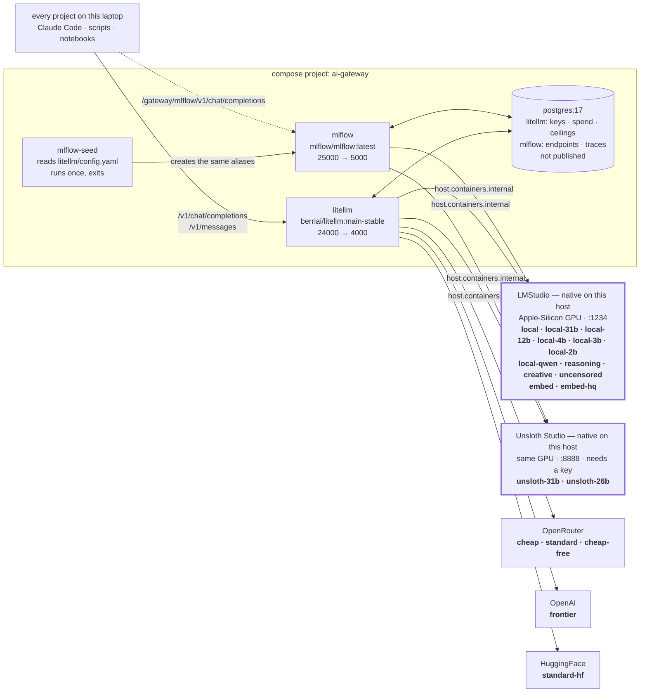
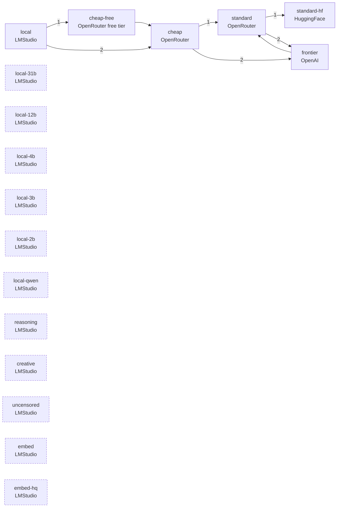
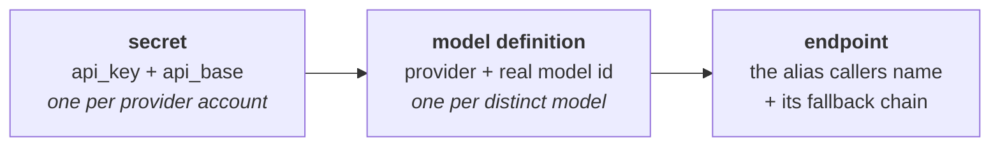

# ai-gateway

The machine-wide LLM gateway: **one OpenAI-compatible endpoint** that every project
on this laptop calls, so switching provider or model is a change *here* rather than in
each repo.

Four containers, and each is load-bearing:

| Service | Host | Notes |
|:--|:--|:--|
| `litellm` | <http://localhost:24000> | **the endpoint every project calls**; admin UI at [`/ui`](http://localhost:24000/ui) |
| `postgres` | *not published* | virtual keys, spend logs, budget ceilings |
| `mlflow` | <http://localhost:25000> | the **same aliases** through the MLflow AI Gateway — § below |
| `mlflow-seed` | *exits* | copies `litellm/config.yaml` into MLflow, then stops |

Runs under both `podman compose` and `docker compose`. LMStudio runs **natively** on
the host; both gateways reach it at `host.containers.internal` / `host.docker.internal`.

## Architecture



**Two local engines, one GPU.** `local*` is LMStudio, `unsloth*` is Unsloth Studio — the
same weights behind `local-31b`/`local` and `unsloth-31b`/`unsloth-26b`, so a caller
compares engines by changing the alias and nothing else. § Unsloth Studio.

A change here is a change to [`compose.yml`](compose.yml) or
[`litellm/config.yaml`](litellm/config.yaml). All three images are stock, so `up -d` needs
**no build step**. The one piece of code is
[`mlflow/seed_gateway.py`](mlflow/seed_gateway.py), and it exists because MLflow has no
config file to mount — § The second gateway.

## Start

```bash
cp .env.example .env          # first time only; leave the provider keys blank
podman compose up -d
curl -fsS http://localhost:24000/health/readiness   # -> {"status":"healthy","db":"connected"}
curl -fsS http://localhost:25000/health             # -> OK
podman compose logs mlflow-seed                     # what it built in MLflow
```

First boot takes a minute: LiteLLM and MLflow each run schema migrations against an empty
database, which is why both healthchecks have a 60 s `start_period`. "unhealthy" inside
that window is expected.

`mlflow-seed` shows as **exited (0)** in `compose ps`, and that is the finished state — it
is a one-shot that runs after `mlflow` is healthy and stops.

Prefer `readiness` over `liveliness` as a probe — both answer unauthenticated, but only
`readiness` reports `"db":"connected"`, and a proxy that booted without a database still
serves completions while `/key/generate` fails.

## Aliases

Call these names, never a model name — the model behind an alias is expected to change.

| Alias | Runs on | Price / 1M tokens | Context in / out | On failure |
|:--|:--|:--|:--|:--|
| `local` | LMStudio, `google/gemma-4-26b-a4b-qat` | free (shadow-priced $0.12 / $0.35) | 253952 / 8192 | → `cheap-free` → `cheap` |
| `local-31b` | LMStudio, `google/gemma-4-31b-qat` | free (shadow-priced $0.14 / $0.40) | 253952 / 8192 | **none, deliberately** |
| `local-12b` | LMStudio, `google/gemma-4-12b-qat` | free (shadow-priced $0.12 / $0.35) | 253952 / 8192 | **none, deliberately** |
| `local-4b` | LMStudio, `google/gemma-4-e4b` | free (shadow-priced $0.12 / $0.35) | **122880** / 8192 | **none, deliberately** |
| `local-3b` | LMStudio, `mistralai/ministral-3-3b` | free (shadow-priced $0.12 / $0.35) | 253952 / 8192 | **none, deliberately** |
| `local-2b` | LMStudio, `google/gemma-4-e2b` | free (shadow-priced $0.12 / $0.35) | **122880** / 8192 | **none, deliberately** |
| `local-qwen` | LMStudio, `qwen/qwen3.8-27b` | free (shadow-priced $0.14 / $0.40) | 253952 / 8192 | **none, deliberately** |
| `unsloth-31b` | **Unsloth**, `unsloth/gemma-4-31B-it-qat-GGUF` | free (shadow-priced $0.14 / $0.40) | 253952 / 8192 | **none, deliberately** |
| `unsloth-26b` | **Unsloth**, `unsloth/gemma-4-26B-A4B-it-qat-GGUF` | free (shadow-priced $0.12 / $0.35) | 253952 / 8192 | **none, deliberately** |
| `cheap` | OpenRouter, `google/gemma-4-26b-a4b-it` | $0.12 / $0.35 | 245760 / 16384 | → `standard` → `frontier` |
| `standard` | OpenRouter, `google/gemma-4-31b-it` | $0.14 / $0.40 | 245760 / 16384 | → `standard-hf` → `frontier` |
| `frontier` | OpenAI, `gpt-5.4-mini` | LiteLLM's built-in rate | provider default | → `standard` |
| `embed` | LMStudio, `text-embedding-nomic-embed-text-v1.5` | free | 2048 | none |
| `embed-hq` | LMStudio, `…nomic-embed-text-v1.5-embedding` (Q8_0) | free | 2048 | none |
| `uncensored` | LMStudio, `gemma-4-31b-it-abliterated` | free (shadow-priced $0.14 / $0.40) | 253952 / 8192 | **none, deliberately** |
| `reasoning` | LMStudio, `thinkingcap-qwen3.6-27b` | free (shadow-priced $0.14 / $0.40) | 253952 / 8192 | **none, deliberately** |
| `creative` | LMStudio, `meta/muse-glimmer` | free (shadow-priced $0.14 / $0.40) | 122880 / 8192 | **none, deliberately** |

`local`, `cheap`, `standard` and `frontier` are tiers — pick one per call. Everything else
is a role: you ask for it because you need that *shape* of model, not that price point.
`embed` and `embed-hq` are embeddings; `uncensored` is abliterated weights; `reasoning`
thinks before it answers; `creative` writes long-form prose; `local-qwen` is the non-Gemma
opinion, named for its family because `reasoning` is *also* a 27B Qwen and a size name
would fit them both. `local-31b` through `local-2b` are the size ladder on this machine's
GPU — same promise as each other, different minutes per prompt.

`unsloth-31b` and `unsloth-26b` are the twins of `local-31b` and `local`: the same weights
at the same QAT quantisation, run by a **second local engine** — Unsloth Studio on port
8888 instead of LMStudio on 1234. They exist so the two engines can be compared by changing
the alias and nothing else. They are named after the engine because the engine is the only
thing that differs, the same way `local-qwen` is named after its family.

Five caveats worth reading before you wire any of these into something:

- **Unsloth serves ONE model at a time, and by default loads nothing on demand.** With
  `Settings → API → Model auto-switch` off, a request for a model that is not loaded
  returns `400 No model loaded` — it does not queue and it does not load. With auto-switch
  on, a call to `unsloth-31b` **unloads** whatever was there and reads ~19 GB from disk
  before the first token. LMStudio's JIT load is the closest equivalent and it has the
  cheaper failure: LMStudio quietly gives you a smaller context window, Unsloth gives you
  an error. `GET /v1/status` on 8888 is the source of truth for what is loaded, and it
  needs the key. **Unlike every other alias here, `unsloth-*` also requires
  `UNSLOTH_API_KEY` in the shell** — see § Configuration.

- **`creative` is the one model LMStudio reports as never trained for tool use**
  (`trainedForToolUse: false`), yet a single-tool request does come back with a proper
  structured `tool_call` — verified 2026-08-23. The flag describes training, not the
  runtime. What is *not* verified is whether that survives an agent loop's many-tool,
  many-turn prompts, which is exactly where an untrained model degrades into raw-text tool
  syntax and an agent run silently executes nothing. Prose is what this alias is for.
- **`reasoning` and `local-qwen` spend their output budget on thinking.** Reasoning tokens
  and the reply draw on the same allowance, so both carry `max_tokens: 8192` where most
  chat routes carry 4096 — a throwaway puzzle already cost `reasoning` 325 reasoning
  tokens, and `local-qwen` spent 59 of 65 completion tokens on "17×23". A thinking model
  that hits the cap mid-thought returns empty content and no error at all. `creative`
  carries 8192 for the same reason compounded by length; note that `local-12b` reasons
  too, on 4096.
- **`local-4b` and `local-2b` have half the window of every other Gemma route** — 122880
  in, not 253952, because the E builds top out at 131072. They also lose to `local-3b` on
  disk (6.86 and 4.37 GB against 2.99 — the "2B" is the larger file) and `local-3b` keeps
  the full window. Their reason to exist is family: they are the bottom of the *Gemma*
  ladder, where `local-3b` is a different vendor and answers differently by design.
- **`embed` and `embed-hq` are the same model at different precision, and their vectors do
  not mix.** Q4_K_M against Q8_0 — quantisation moves where a text lands in the space, so
  a query embedded with one and matched against an index built with the other returns
  quietly worse neighbours and never errors. Pick one per index and record which.

`cheap-free` and `standard-hf` also exist and are **not** part of that vocabulary — they
are fallback targets only. Every `local-*` name wears the same kind of suffix and is the
exception: they are names to call. Every number above, and the reasoning behind it, is in
[`litellm/config.yaml`](litellm/config.yaml).

```bash
curl http://localhost:24000/v1/chat/completions \
  -H "Authorization: Bearer $LITELLM_MASTER_KEY" \
  -H 'Content-Type: application/json' \
  -d '{"model":"local","messages":[{"role":"user","content":"hi"}]}'
```

### Where a failed call goes next



Two consequences that look like bugs and are not:

- **`local` is not guaranteed to stay local.** When LMStudio is unreachable it lands on
  the same weights at OpenRouter — so a stopped LMStudio changes *where* the request ran,
  not *what* ran, but a "free" session can quietly accrue real spend. The `api_base`
  column in `/spend/logs` is how you tell after the fact.
- **`uncensored` has no chain at all.** A hosted twin would both refuse the request and
  see a prompt that was chosen to stay on this machine, so it fails instead. `embed` is
  likewise terminal.
- **`local-31b` has no chain either, for a different reason.** Its hosted twin *is*
  `standard` and would answer perfectly well — the omission is so that this name always
  means "these weights, on this machine, free". Want the cloud twin, knowingly? Call
  `standard`. That promise is why every LMStudio alias except `local` is terminal:
  `local-12b`, `local-4b`, `local-3b`, `local-2b`, `local-qwen`, `reasoning`, `creative`
  and `embed-hq` have no hosted twin in this config at all, so a chain could only send them
  somewhere that answers differently. `local` is the single deliberate exception, and it is
  the only local alias that can surprise you with spend.

Separately, a request that *overflows* its window falls to `frontier` rather than down the
chain above — `frontier` is the only larger window here.

## Endpoints

Verified 2026-08-21 against a running stack.

| Method | Path | Auth | What |
|:--|:--|:--|:--|
| `GET` | `/health/liveliness` | none | `"I'm alive!"` — the process is up |
| `GET` | `/health/readiness` | none | `{"status":"healthy","db":"connected"}` — **the useful probe** |
| `GET` | `/health` | master key | live per-model check; costs one call to each provider |
| `POST` | `/v1/chat/completions` | any key | the OpenAI route |
| `POST` | `/v1/messages` | any key | the Anthropic route — what Claude Code drives |
| `POST` | `/v1/embeddings` | any key | `embed` and `embed-hq`; both return 768 dims |
| `GET` | `/model/info` | master key | which aliases are actually registered |
| `POST` | `/key/generate` | master key | mint a capped key (§ below) |
| `GET` | `/key/info` | the key itself | its models, ceiling, spend and expiry |
| `GET` | `/spend/logs` | master key | every request, with `model`, `spend` and `api_base` |
| — | `/ui` | master key | admin UI; the Logs tab carries prompt and response |

## The second gateway — MLflow

The same alias names, served by the **MLflow AI Gateway** at
<http://localhost:25000>. It exists so the two gateways can be compared on one machine
without changing any caller's vocabulary: swap the base URL, keep the model name.

**LiteLLM stays the primary endpoint.** It is what every project calls, and it is the only
one with virtual keys, spend logs and budget ceilings. Nothing about port 24000 changed.

### MLflow has no config file

LiteLLM reads `litellm/config.yaml` at every boot. MLflow cannot: its gateway configuration
lives in the tracking database and arrives over an API. So `mlflow/` holds a script, not a
`config.yaml`, and one LiteLLM entry becomes three MLflow objects:



[`mlflow/seed_gateway.py`](mlflow/seed_gateway.py) reads **LiteLLM's own file** rather than
keeping a second list, and that is what stops the two drifting apart. Add an alias to
`litellm/config.yaml`, run `podman compose up -d`, and MLflow serves it too. It runs on
every `up -d` and is idempotent.

```bash
podman compose logs mlflow-seed                              # what it built, and what it skipped
podman compose run --rm mlflow-seed python /app/seed_gateway.py /app/litellm-config.yaml --reset
podman compose run --rm mlflow-seed python /app/seed_gateway.py /app/litellm-config.yaml --prune
```

`--reset` rebuilds every endpoint. `--prune` deletes endpoints `config.yaml` no longer
names; without it they are reported and left alone, because someone may have made them by
hand in the UI.

### Calling it

Verified 2026-08-26 against a running stack, MLflow 3.15.1.

| Method | Path | What |
|:--|:--|:--|
| `POST` | `/gateway/mlflow/v1/chat/completions` | the OpenAI route — `"model"` is the alias |
| `POST` | `/gateway/<alias>/mlflow/invocations` | the same call, alias in the path |
| `POST` | `/gateway/openai/v1/embeddings` | `embed` and `embed-hq`; both return 768 dims |
| `GET` | `/health` | `OK` — unauthenticated, and one of only two routes exempt from the Host header check |
| — | `/` | the MLflow UI: **AI Gateway → Endpoints**, and one `gateway/<alias>` experiment per alias |

```bash
curl -sX POST http://localhost:25000/gateway/mlflow/v1/chat/completions \
  -H 'Content-Type: application/json' \
  -d '{"model":"local-3b","messages":[{"role":"user","content":"Reply with exactly: OK"}]}'
```

There is **no key**. This gateway has no virtual keys at all, so anything that reaches the
port can call any alias — which is one more reason it binds localhost only.

Tool calling works: a single-tool request through `local-3b` came back with
`finish_reason: "tool_calls"` and a structured `tool_calls` block, not the raw-text tool
syntax that makes an agent silently execute nothing (verified 2026-08-26).

### Traces, for free

Every endpoint is created with `usage_tracking=True`, so each request becomes an MLflow
trace in an auto-created experiment named `gateway/<alias>` — no callback, no autolog call,
no client-side code. That is the one thing this gateway does that LiteLLM cannot do without
an external trace store.

The trace is written **after** the response is returned, so read it in a poll, not
immediately.

This does not contradict § What this repo deliberately does not run. MLflow here traces
**what passes through its own endpoints** and nothing else; it is not a trace store for
other projects, and `success_callback` in `litellm/config.yaml` is still empty.

### What does not transfer

Six things in `config.yaml` have **no equivalent** here. This is the honest part of the
comparison, and it is why LiteLLM stays the primary gateway.

| `litellm/config.yaml` | Status in MLflow |
|:--|:--|
| `/v1/messages` (the Anthropic route) | **Not available for these aliases.** The passthrough exists only for endpoints whose provider is Anthropic; ours are `openai`-protocol, and the call answers `Unsupported passthrough endpoint '/anthropic/v1/messages' for OpenAI provider`. **Claude Code therefore stays on port 24000** — § Claude Code. |
| Virtual keys, `/key/generate`, `/spend/logs` | No equivalent. MLflow has budget policies, which cap **cost per endpoint**, not per caller, and there is no key to hand a project. |
| `input_cost_per_token` / `output_cost_per_token` | Not carried across, so the shadow pricing that makes a local call show up against a ceiling does not exist here. |
| `model_info.max_input_tokens` + `enable_pre_call_checks` | No equivalent. An over-long prompt fails at the model instead of being caught before the call. |
| `drop_params: true` | No equivalent. Every parameter is forwarded exactly as sent. |
| `timeout: 3600` per route | One **global** figure instead: `MLFLOW_GATEWAY_ROUTE_TIMEOUT_SECONDS`, set to 3600 in `compose.yml` because MLflow's own default of 300 s cuts off a long local prompt mid-run. |

`context_window_fallbacks` has no equivalent either — MLflow falls back on **error only** —
but both fallback maps are commented out in `config.yaml` today, so nothing is lost right
now. Uncomment them and `mlflow-seed` builds the error chains, not the overflow ones.

## Tests

`tests/` drives **both** gateways with the real OpenAI client — same alias, same
message body, different `base_url`. That is the claim this repo makes, so it is what
gets checked.

```bash
cd tests
uv sync                     # once
uv run run_all.py           # 3 scripts x 2 gateways = 6 rows
```

```text
model=local-3b  gateways=litellm, mlflow

PASS  01_simple_call.py      litellm     0.5s
PASS  01_simple_call.py      mlflow      0.5s
PASS  02_tools_call.py       litellm     0.8s
PASS  02_tools_call.py       mlflow      0.8s
PASS  03_multimodal.py       litellm     0.5s
PASS  03_multimodal.py       mlflow      0.5s

6/6 passed
```

| Script | What it proves |
|:--|:--|
| `01_simple_call.py` | a plain chat completion, with a multi-turn conversation |
| `02_tools_call.py` | a structured `tool_calls` reply — **not** raw-text tool syntax — then the second turn that uses the tool result |
| `03_multimodal.py` | an image plus a question, as a base64 `data:` URL |

Every script prints the full response and then the extracted text, so each one doubles
as a sample to copy from. `--gateway litellm|mlflow|both` and `--model <alias>` pick the
target; the default alias is `local-3b`, the smallest route that is both vision-capable
and tool-trained. Exit code is `1` on any failure.

The whole story, including what is deliberately **not** covered — `/v1/messages`,
embeddings, budgets, fallbacks — is in [`tests/README.md`](tests/README.md).

Verified 2026-08-26 against a running stack: 6/6 on `local-3b`.

## Claude Code

LiteLLM exposes `/v1/messages`, so Claude Code can drive any alias above: point
`ANTHROPIC_BASE_URL` at `http://localhost:24000` (no `/v1` suffix) and map all three
`ANTHROPIC_DEFAULT_*_MODEL` slots onto aliases — leave one unset and it sends a real
Claude model id the gateway has never heard of.

**[`NOTES.md`](NOTES.md) is the whole story**: the variable table, the three ways to apply
it, per-alias configurations, the two timeouts a local model needs, and a troubleshooting
table. Tool calling through `local`, `local-31b`, `local-3b`, `local-qwen` and `uncensored`
is verified there with dates — a structured `tool_use` block, not the raw-text tool syntax
that makes most local models unusable from an agent.

> Do not hand it the master key for anything longer than a try-out. That key has **no
> spending ceiling**, and `local` reaches OpenRouter when LMStudio is down — free while it
> is up, uncapped when it is not.

## Budget-capped keys

The master key mints others and **has no ceiling of its own**, so it is not what a project
should hold. Issue a capped, expiring key instead:

```bash
curl -X POST http://localhost:24000/key/generate \
  -H "Authorization: Bearer $LITELLM_MASTER_KEY" \
  -H 'Content-Type: application/json' \
  -d '{"models":["local","cheap"],"max_budget":0.50,"duration":"24h"}'
```

Check one at any time with `curl -H "Authorization: Bearer $KEY" http://localhost:24000/key/info`.

`local` is **shadow-priced** — it runs free on this machine but carries its OpenRouter
twin's rate, so spend accrues and a ceiling can actually trip. That figure is "what this
workload would cost on the cloud twin", not money anyone was billed; anything summing
`/spend/logs` has to say which it is reporting. Setting both `*_cost_per_token` values on
`local` to `0` turns it off, at the cost of ceilings no longer applying locally.

A `{"error":"No connected db."}` here means the proxy booted without `DATABASE_URL`.
Completions keep working, which is why this has to be tested rather than assumed.

## Configuration

`compose.yml` interpolates from the **shell environment first**, then `.env` — that
ordering is the whole design.

| Variable | Default | Used by |
|:--|:--|:--|
| `LITELLM_MASTER_KEY` | `sk-litellm-master` | the admin credential; mints keys, no ceiling |
| `LM_STUDIO_API_BASE` | `http://host.containers.internal:1234/v1` | every local alias — the whole `local-*` ladder plus `local-qwen`, `reasoning`, `creative`, `uncensored`, `embed`, `embed-hq`. Docker: `host.docker.internal` |
| `UNSLOTH_API_BASE` | `http://host.containers.internal:8888/v1` | `unsloth-31b`, `unsloth-26b` — the second local engine |
| `UNSLOTH_API_KEY` | *(blank by design)* | **required** by both `unsloth-*` aliases. Unlike LMStudio, Unsloth 401s every route without it |
| `OPENROUTER_API_KEY` | *(blank by design)* | `cheap`, `standard`, `cheap-free` |
| `OPENAI_API_KEY` | *(blank by design)* | `frontier` |
| `HF_TOKEN` | *(blank by design)* | `standard-hf` |
| `DATABASE_URL` | set in `compose.yml` | **required** — without it `/key/generate` fails while completions do not |
| `MAX_STRING_LENGTH_PROMPT_IN_DB` | `100000` | LiteLLM's own default of 2048 clips agent transcripts mid-run |
| `MLFLOW_CRYPTO_KEK_PASSPHRASE` | *(blank)* | wraps the key that encrypts MLflow's stored credentials. Blank is supported — MLflow uses a built-in passphrase and logs a warning. **Change it later and the stored secrets stop decrypting**; the repair is `up -d`, which rewrites them |
| `MLFLOW_GATEWAY_ROUTE_TIMEOUT_SECONDS` | `3600`, set in `compose.yml` | MLflow's own default is 300 s, which gives up mid-prompt on a local model |
| `MLFLOW_SERVER_ALLOWED_HOSTS` | set in `compose.yml` | must list `mlflow:5000` and `0.0.0.0:5000`, or in-stack calls and the server's own get 403 while `/health` still says `OK` |

The four provider keys stay blank in `.env` **on purpose**: `~/Projects/.envrc` already
exports them from `~/.secrets/secrets.enc.yaml` into every shell under `~/Projects`, and
compose reads the shell first. Writing them into `.env` anyway creates a second plaintext
copy that a rotation will not reach. See [`.env.example`](.env.example).

> **`UNSLOTH_API_KEY` missing fails twice, differently.** LiteLLM keeps the `unsloth-*`
> aliases and returns `401` at call time; `mlflow-seed` skips them with "no API key in the
> environment" and MLflow never creates the endpoints, so the same name **404s on 25000 and
> 401s on 24000**. If you have just added the key, `podman compose up -d` again — the seed
> is idempotent and will create what it skipped.

## LMStudio

The context limits declared in the config are only true for a model **hand-loaded** with
matching flags. A JIT-loaded model does not inherit them and gets a 1 h TTL, so it can
silently come back smaller an hour after its last request — at 8192, against an agent
prompt many times that size.

Load the model behind the alias you are about to use; they are different models:

```bash
lms load google/gemma-4-26b-a4b-qat  --context-length 262144 --parallel 1 --gpu max  # local
lms load google/gemma-4-31b-qat      --context-length 262144 --parallel 1 --gpu max  # local-31b
lms load google/gemma-4-12b-qat      --context-length 262144 --parallel 1 --gpu max  # local-12b
lms load mistralai/ministral-3-3b    --context-length 262144 --parallel 1 --gpu max  # local-3b
lms load qwen/qwen3.8-27b            --context-length 262144 --parallel 1 --gpu max  # local-qwen
lms load thinkingcap-qwen3.6-27b     --context-length 262144 --parallel 1 --gpu max  # reasoning
lms load gemma-4-31b-it-abliterated  --context-length 262144 --parallel 1 --gpu max  # uncensored

# These three advertise 131072, not 262144 (`lms ls --json` → maxContextLength).
lms load google/gemma-4-e4b          --context-length 131072 --parallel 1 --gpu max  # local-4b
lms load google/gemma-4-e2b          --context-length 131072 --parallel 1 --gpu max  # local-2b
lms load meta/muse-glimmer           --context-length 131072 --parallel 1 --gpu max  # creative

lms ps --json    # the source of truth, not the UI
```

262144 is the maximum the first group advertises; the second group's ceiling is 131072,
which is where `local-4b`, `local-2b` and `creative` get their 122880 input limit. These
are separate models on one GPU — load the one you are about to call rather than all of
them. The two embedding routes are the exception worth not thinking about: at 84 and
146 MB they load in under a second, so JIT is fine for them.

`--parallel 1` is deliberate, and it is the flag most likely to be "improved" wrongly. An
agent client fires its main turn and its background calls (titles, summaries) at once; at
`--parallel 4` they split one GPU four ways and everything slows together — a 1-token
request measured **34 s** while large prompts sat in front of it. Serialising is faster end
to end.

Prompt processing on this machine measures **~100 tok/s** (17.6k tokens in 173 s), so an
agent-scale prompt needs minutes before its first token. That is why the two LMStudio chat
routes carry `timeout: 3600` — and why the client's own timeout has to be raised in step,
or it hangs up first and the gateway's patience is wasted.

## Unsloth Studio — the second engine

Native on the host at `127.0.0.1:8888`, serving `unsloth-31b` and `unsloth-26b`. It runs
the **same weights** as `local-31b` and `local`, so the pair exists to compare engines, not
models. Verified 2026-08-27 against a running stack.

It is not a drop-in twin of LMStudio. Four differences, each of which fails in its own way:

| | LMStudio (1234) | Unsloth (8888) |
|:--|:--|:--|
| Key | any string | **required** — every route 401s, `/v1/models` included |
| Model not loaded | JIT-loads it, quietly at 8192 context with a 1 h TTL | `400 No model loaded`, unless auto-switch is on |
| Models held at once | several | **one** — a new request unloads the last |
| Reasoning | off for `gemma-4-26b-a4b-qat` | **on** for the same weights |

That last row is the one that surprised me and it is why both `unsloth-*` routes carry
`max_tokens: 8192` where their LMStudio twins carry 4096. Asked for one sentence with a
60-token ceiling, `unsloth-26b` returned **empty content**, `finish_reason: "length"`, and
a full reasoning block — the whole budget spent thinking. At 1000 tokens it answered in
117. There is no error in that failure, which is what makes it worth a paragraph.

```bash
# Its truth, and both need the key
curl -s http://127.0.0.1:8888/v1/status -H "Authorization: Bearer $UNSLOTH_API_KEY"
curl -s http://127.0.0.1:8888/v1/models -H "Authorization: Bearer $UNSLOTH_API_KEY"
```

**`Settings → API → Model auto-switch` must be on** or every `unsloth-*` call fails until
somebody loads a model by hand. With it on, a call to `unsloth-31b` unloads `unsloth-26b`
and loads 17 GB before answering.

That swap is cheaper than it sounds. Measured 2026-08-27: a cold load of the 26B took
**14 s**, the swap to the 31B **10.1 s**, and the swap back to the 26B **4.4 s** — the file
is in the page cache by then, and 128 GB of RAM means it stays there. So alternating
between the two aliases is a few seconds, not a coffee break, and there is no reason to
avoid it in normal use. Leave `auto_download_model` **off**: on, an unknown model id
becomes a multi-gigabyte download rather than an error.

Unsloth also indexes the LMStudio model folder, so `GET /v1/models` lists 12 models here,
including Ministral, Muse-Glimmer and the abliterated 31B. Anything in the LMStudio ladder
could be given an Unsloth twin the same way.

## Ports

`24000` and `25000` are a deliberate third band. Two other stacks on this machine hold
ports, and the failure being avoided is not a loud bind error but the silent one — a health
probe against `localhost:4000` that a *different* project's gateway answers, going green.
`mlflow-tutorial` runs its own MLflow on `5555`, which is exactly why this one is not on
`5000`.

| Stack | Band |
|:--|:--|
| `mlflow-tutorial` | 3000, 4000, 5432, 5555, 6333/4, 7233, 8080, 9090 |
| `ai-agent-platform` | 1xxxx — 14000, 15000 |
| `ai-gateway` | 2xxxx — 24000 (litellm), 25000 (mlflow) |

Container-internal ports are unchanged; on the compose network nothing can collide.

## Troubleshooting

Claude-Code-specific symptoms are in [`NOTES.md`](NOTES.md). These are the gateway's own.

| Symptom | Cause | Fix |
|:--|:--|:--|
| `unhealthy` for the first minute after `up -d` | schema migrations against an empty database | expected — wait out the 60 s `start_period` |
| `{"error":"No connected db."}` from `/key/generate` | the proxy booted without `DATABASE_URL` | `curl /health/readiness` — it reports `db` |
| 401 from a priced alias only | the shell that ran `up -d` had no direnv, so the key interpolated blank | re-run `up -d` from a shell under `~/Projects` |
| Non-zero spend on `local` | LMStudio was down and the fallback chain ran | expected — check `api_base` in `/spend/logs` |
| `local` fails instantly, context error | LMStudio JIT-loaded it at 8192 | hand-load it — § LMStudio |
| An agent runs a step or two, executes nothing, exits cleanly | tool calls returned as raw text by the wrong OpenRouter free-tier provider | the provider pin in `litellm/config.yaml` — check it is intact |
| A health probe is green but nothing works | it probed `localhost:4000`, which another stack answers | § Ports |
| `Engine protocol predict request failed: fetch failed` in the logs | a timeout fired mid-prompt and tore down LMStudio's engine socket; it maps to a 400, and a 400 is never retried | raise **both** timeouts — § LMStudio |
| `mlflow-seed` shows as exited in `compose ps` | it is a one-shot, and exit 0 is the finished state | expected — read `compose logs mlflow-seed` |
| An alias answers on 24000 and 404s on 25000 | `mlflow-seed` has not run since you added it to `config.yaml` | `podman compose up -d`, then check its log |
| `unsloth-*` gives `400 No model loaded` | Unsloth serves one model at a time and auto-switch is off | turn on `Settings → API → Model auto-switch` — § Unsloth Studio |
| `unsloth-*` 401s on 24000 **and** 404s on 25000 | `UNSLOTH_API_KEY` was blank when `up -d` ran: LiteLLM kept the alias, `mlflow-seed` skipped it | export the key, `podman compose up -d` again |
| `unsloth-*` returns empty content, `finish_reason: "length"` | these weights reason under Unsloth, and the reasoning block ate the whole `max_tokens` | raise the caller's `max_tokens`; the routes already carry 8192 |
| MLflow answers 403 `Invalid Host header` | the caller's `Host` is not in `MLFLOW_SERVER_ALLOWED_HOSTS`, and `/health` is exempt so the container still looks healthy | add that host:port — § Configuration |
| Every MLflow alias fails with an auth error, LiteLLM is fine | `MLFLOW_CRYPTO_KEK_PASSPHRASE` changed, so the stored secrets no longer decrypt | `podman compose up -d` — `mlflow-seed` rewrites every secret |

Every request lands in the admin UI's Logs tab at <http://localhost:24000/ui>, prompt and
response included. Look there before changing configuration.

## Repository structure

```text
ai-gateway/
├── .claude/            the contract this repo is maintained under
├── .env.example        tracked; the three provider keys are blank BY DESIGN
├── .gitignore
├── compose.yml         four services, ports, healthchecks, env wiring
├── litellm/
│   └── config.yaml     aliases, prices, fallback chains, provider pins
├── mlflow/
│   └── seed_gateway.py reads that config.yaml into the MLflow gateway
├── postgres/
│   └── init-databases.sh   creates the `mlflow` database, on a fresh volume only
├── tests/              a uv project — § Tests
│   ├── common.py           the two base URLs, the client, the pass/fail printing
│   ├── 01_simple_call.py   plain chat completion
│   ├── 02_tools_call.py    tools, and the second turn that uses the result
│   ├── 03_multimodal.py    an image plus a question
│   ├── run_all.py          every script x every gateway, as a table
│   └── test_image.png      256x256, one red circle on white
├── NOTES.md            connecting Claude Code to this gateway
└── README.md           start here — aliases, endpoints, keys, ports
```

## What this repo deliberately does not run

- **No trace store for other projects.** MLflow is a *project's* system of record for "did
  this get better"; two projects sharing one experiment namespace makes that question
  ambiguous. The `mlflow` service here is a **gateway**, and it traces only what passes
  through its own endpoints. `success_callback` in `litellm/config.yaml` is still empty —
  trace client-side, or point a callback at your own server.
- **No custom image.** All three are stock, so there is no build step. The MLflow image
  already ships `psycopg2` and `cryptography`, which is everything the Postgres backend and
  the gateway's encrypted secrets need. A `litellm/Dockerfile` returns the day a callback
  needs a package it lacks.
- **No secrets.** They arrive from the shell, never from this repo — § Configuration.
- **No test suite.** There is nothing to unit-test in three stock images, a YAML file and a
  seed script. Verification is `/health/readiness` plus one real completion through the
  alias you touched — on **both** gateways, if you touched `config.yaml`.

Derived from `~/Projects/Github/lukaskellerstein/ai-agent-platform/deploy/compose`, minus
its client-side trace store and its `judge` / `optimizer` role aliases.
