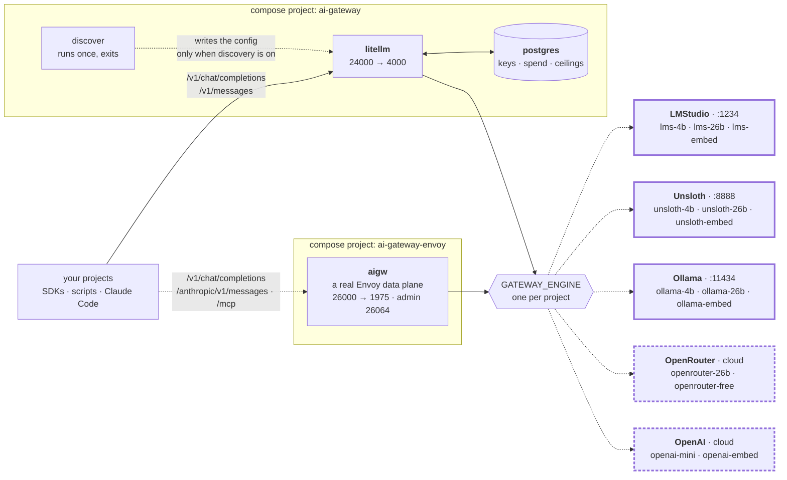

# ai-gateway

[](LICENSE)


**One OpenAI-compatible endpoint in front of every model on your machine.**

Your projects call `http://localhost:24000` and ask for a name like `lms-4b` or `ollama-4b`.
Which model that name points at is decided **here**, in this repo's config — so swapping a
model is one edit here, not an edit in every project that calls it.

```bash
curl http://localhost:24000/v1/chat/completions \
  -H "Authorization: Bearer sk-litellm-master" \
  -H 'Content-Type: application/json' \
  -d '{"model":"lms-4b","messages":[{"role":"user","content":"hi"}]}'
```

It supports five engines: **LMStudio, Unsloth Studio and Ollama** on your own machine, and
**OpenRouter and OpenAI** in the cloud. An engine is an engine — the alias prefix says which
is which, and `openrouter-26b` is the same weights as `lms-26b` on hardware you do not own.

**One engine runs at a time**, and one word in a `.env` picks it. That engine serves two or
three aliases — a small chat model, a large one, an embedder. To compare two engines, change
the word and `up -d` again: the names differ only in the prefix.

## What you get

- **Two gateways that share one vocabulary** — LiteLLM on 24000, Envoy AI Gateway on 26000.
  Both answer the same alias names, so a caller moves between them unchanged.
- **Virtual keys, spend logs and budget ceilings** — on LiteLLM, backed by its own postgres.
  Local routes are shadow-priced, so a ceiling still trips on free traffic.
- **Every calling style is a worked example** — 29 test scenarios per gateway, from raw
  `urllib` to the Claude Agent SDK, Codex, OpenCode, LangGraph and DeepAgents.
- **Auto-discovery, off by default** — turn it on and the gateway also serves every model
  already on your disk, without shadowing a single hand-written alias.
- **A measured overhead of 10–20 ms**, flat, on both gateways —
  [`benchmark/`](benchmark/README.md) is the proof.
- **No build step and almost no code** — stock images, two `compose.yml`, eleven config files.
  There is no Dockerfile in this repo.

## One repo, separate projects

**Each gateway is its own compose project.** It has its own `compose.yml`, its own `.env`, its
own config, its own tests and its own README. You start one by entering its folder. You remove
one by deleting its folder. Nothing at the repo root starts anything.

| Folder | Port | What it is | Start it with |
|:--|:--|:--|:--|
| [`litellm/`](litellm/) | **24000** | the primary endpoint: virtual keys, spend logs, budget ceilings, `/v1/messages`, an admin UI | `cd litellm && podman compose up -d` |
| [`envoy/`](envoy/) | **26000** | the same alias names through [Envoy AI Gateway](https://aigateway.envoyproxy.io/docs) in standalone mode — a real Envoy data plane, no Kubernetes. Adds MCP, Prometheus and OpenTelemetry; has no spend controls | `cd envoy && podman compose up -d` |

**Start with `litellm/`.** It is the one every project should call, and the only one with
spend controls — `envoy/` cannot cap a caller at all. `envoy/` is a second implementation of
the same vocabulary, useful for comparing gateways rather than for running work through.

A third gateway, the MLflow AI Gateway on port 25000, was here until 2026-09-04 and was
removed. [The bottom of this file](#what-was-removed) says why.

**`envoy/` is the one you could actually deploy.** Its config is the same Kubernetes
custom-resource API the Envoy AI Gateway controller reads in a cluster, so what is proven on
this laptop is what would ship. It is also the only one here with an **MCP gateway**,
Prometheus metrics and OpenTelemetry tracing.

**Both can run at the same time**, on different ports and different engines, and neither
reads a file belonging to the other. That independence has a price, and it is the one thing
to know before you add an alias:

> **An alias is one edit per gateway, and nothing checks that you did them both.** Add
> `my-alias` to `litellm/config/<engine>.yaml` only, and it answers on 24000 and 404s on
> 26000, with nothing in any log to say why. There used to be a shared test suite that
> caught this. There is not one now.



**Exactly one engine is live per project** — the dashed edges are the ones that are not. Solid
borders are on this machine and free; dashed borders are hosted and **billed**. With a local
engine selected, that gateway has no hosted route at all: not a disabled one, an absent one.
There are no fallback chains either, so picking the engine is the only decision that can cost
money.

**Only LiteLLM runs a postgres**, and it does not publish a port. It holds the virtual keys,
the spend logs and the budget ceilings. **`envoy/` has no database at all** — its whole
configuration is one file.

The three local engines run **natively on the host**: they need the GPU. The containers reach
them at `host.containers.internal` / `host.docker.internal`, and every `compose.yml` declares
both names so Docker and Podman behave the same. The two hosted engines need only a
key in your shell.

## Quick start

**Podman is what this repo is run with**, and `docker compose` works too — the two are drop-in
replacements here, so
swap the word and nothing else changes — and at least one local engine on the host:
[LMStudio](https://lmstudio.ai), [Ollama](https://ollama.com) or
[Unsloth Studio](https://unsloth.ai). With no local engine at all, use an OpenRouter or OpenAI
key and `GATEWAY_ENGINE=openrouter`.

```bash
cd litellm
cp .env.example .env            # edit GATEWAY_ENGINE if you do not run LMStudio
podman compose up -d            # first boot takes ~60 s: LiteLLM runs schema migrations

curl -fsS http://localhost:24000/health/readiness   # -> {"status":"healthy","db":"connected"}
```

Then get the models for **the one engine you selected** — three each, and you need no others.
The commands are in that engine's config file, which also carries every trap it has:
[`litellm/config/lms.yaml`](litellm/config/lms.yaml),
[`litellm/config/unsloth.yaml`](litellm/config/unsloth.yaml),
[`litellm/config/ollama.yaml`](litellm/config/ollama.yaml). The hosted engines download
nothing.

For the other gateway, do the same in `envoy/`. It is independent: its own `.env`, its own
engine if you want a different one, and its own `up -d`.

Everything here is measured on an Apple-Silicon MacBook with 128 GB of RAM.

### Call it from code

Any OpenAI-compatible client works. Point the base URL at the gateway and ask for an **alias**.

```python
from openai import OpenAI

client = OpenAI(base_url="http://localhost:24000/v1", api_key="sk-litellm-master")

reply = client.chat.completions.create(
    model="unsloth-4b",                 # the alias, never the model name
    messages=[{"role": "user", "content": "say hi"}],
    max_tokens=512,                     # required on 26000, optional on 24000
)
print(reply.choices[0].message.content)
```

On port 26000 the key is ignored — **Envoy authenticates no caller at all** — and `max_tokens`
stops being optional, because Envoy stores no route default. Each `tests/` directory is 29 more
worked examples, one per way of calling the gateway.

## Configuration

**Each project reads its own `.env`, and nothing checks that the two agree.** Copy
`.env.example` to `.env` in the folder you are starting; both example files are heavily
commented, and this table is the short version.

| Variable | Values | Default | In | Decides |
|:--|:--|:--|:--|:--|
| `GATEWAY_ENGINE` | `lms` · `unsloth` · `ollama` · `openrouter` · `openai` | `lms` | both | which engine runs, and so which two or three aliases exist |
| `GATEWAY_DISCOVERY` | *empty* · `on` | *empty* | `litellm/` | empty serves the hand-written list; set, it **adds** every model the engine holds on disk |
| `AIGW_DEBUG` | `false` · `true` — **never empty** | `false` | `envoy/` | per-request logging. An empty value crash-loops the container: aigw parses it as a bool |
| `LITELLM_MASTER_KEY` | any string | `sk-litellm-master` | `litellm/` | the admin credential that mints virtual keys |
| `UNSLOTH_API_KEY` | a key | *empty* | both | Unsloth answers `401` on every route without it |
| `OPENROUTER_API_KEY` `OPENAI_API_KEY` | a key | *empty* | both | needed only when `GATEWAY_ENGINE` names that engine |

**Leave the three key lines blank.** Compose reads your shell environment first and the file
second, so an exported key reaches the container without a second plaintext copy that a
rotation will never reach. A missing key does not stop a gateway booting: the alias stays
registered and answers `401` when something calls it.

> **`GATEWAY_DISCOVERY=off` does not turn discovery off.** Compose builds the config filename
> from `${GATEWAY_DISCOVERY:+discovered-}`, which reacts to the word being non-empty and not to
> its meaning. `off`, `false`, `0` and `no` are caught and refused. **The way to turn it off is
> an empty value.**

## Endpoints

Both gateways answer these. The full per-gateway tables — with what each route needs and what
it returns — are in [`litellm/README.md`](litellm/README.md#call-it) and
[`envoy/README.md`](envoy/README.md#call-it).

| What you want | LiteLLM 24000 | Envoy 26000 |
|:--|:--|:--|
| the OpenAI route | `POST /v1/chat/completions` | same |
| embeddings, on the engine's `*-embed` alias | `POST /v1/embeddings` | same |
| the Responses API — the Codex SDK needs it | `POST /v1/responses` | same |
| which aliases are being served right now | `GET /v1/models` | same |
| the Anthropic route — Claude Code drives it | `POST /v1/messages`, on the plain alias | `POST /anthropic/v1/messages`, on `<alias>-anthropic` |
| the health probe | `GET /health/readiness` | `GET /v1/models` |

All six verified on both ports on 2026-09-05, engine `unsloth`. **On 26000 the Anthropic route
needs the `-anthropic` name** — `unsloth-4b-anthropic`, not `unsloth-4b`. That alias is the same
model on the same engine, reached through a backend that speaks Anthropic natively so nothing
is translated; [the tests section](#what-has-actually-been-run) says what happens when
something is.

**Never probe `26064/health`.** The admin port answers `OK` several seconds before the data
plane on 26000 accepts a connection, so it goes green while the next call gets a connection
reset.

**LiteLLM alone has a control plane** — `/key/generate`, `/key/info`, `/spend/logs`,
`/model/info`, and an admin UI at `/ui` whose Logs tab carries the prompt and the response.
**Envoy alone has `/mcp`**, an MCP gateway that puts several MCP servers behind one endpoint
(the route exists; it needs `--mcp-config` and is not wired up here), and Prometheus metrics
on 26064.

## The aliases

Call these names, never a model name. **Both gateways use the same names**, which is the
whole reason more than one of them exists.

**Every alias names its engine** — `lms-*` is LMStudio, `unsloth-*` is Unsloth, `ollama-*` is
Ollama, `openrouter-*` is OpenRouter, `openai-*` is OpenAI. There is deliberately no
engine-neutral name and no capability name, so a caller always knows which engine answered
and, just as importantly, **who is being billed**. The first three are this machine and free;
the last two are the cloud and cost money.

|  | LMStudio (`:1234`) | Unsloth (`:8888`) | Ollama (`:11434`) | OpenRouter | OpenAI |
|:--|:--|:--|:--|:--|:--|
| **Chat, small** | `lms-4b` | `unsloth-4b` | `ollama-4b` | — | `openai-mini` |
| **Chat, large** | `lms-26b` | `unsloth-26b` | `ollama-26b` | `openrouter-26b` | — |
| **Embed** | `lms-embed` | `unsloth-embed` | `ollama-embed` | — | `openai-embed` |
| **Extra** | — | — | — | `openrouter-free` | — |
| **Costs** | free | free | free | **paid** | **paid** |

That is every alias this repo defines **by hand**. `GATEWAY_ENGINE` selects **one column**, so
a gateway serves two or three names at a time — never the whole table. The rows are the point:
the same model sits across a row, so changing the engine word and re-running the tests
measures the engine and nothing else. You do not need every engine — name the one you have,
and the rest are not in the config at all.

**Provider** is the prefix LiteLLM routes on — the `model:` value in
`litellm/config/<engine>.yaml`. It is in this table because it is not cosmetic: LiteLLM
picks a different upstream path per provider, so two aliases that look alike can behave
differently on `/v1/messages`. `litellm/README.md` § Provider × route has the details.

| Alias | Model | Provider | Gateways | Input | Build | Notes |
|:--|:--|:--|:--|--:|:--|:--|
| `lms-4b` | `google/gemma-4-e4b` | `lm_studio/` | both | 122880 | QAT | tools and vision both work |
| `lms-26b` | `google/gemma-4-26b-a4b-qat` | `lm_studio/` | both | 253952 | QAT | 26B MoE, ~4B active |
| `lms-embed` | `text-embedding-nomic-embed-text-v1.5` | `lm_studio/` | both | 2048 | Q4_K_M | 768 dims, 84 MB |
| `unsloth-4b` | `unsloth/gemma-4-E4B-it-qat-GGUF` | `openai/` | both | 122880 | QAT | same weights as `lms-4b` |
| `unsloth-26b` | `unsloth/gemma-4-26B-A4B-it-qat-GGUF` | `openai/` | both | 253952 | QAT | same weights as `lms-26b`; **it reasons and `lms-26b` does not** |
| `unsloth-embed` | `second-state/Nomic-embed-text-v1.5-Embedding-GGUF` | `openai/` | both | 2048 | Q8_0 | 768 dims |
| `ollama-4b` | `gemma4:e4b` | `openai/` | both | 122880 | **Q4_K_M** | not QAT — see below |
| `ollama-26b` | `gemma4:26b` | `openai/` | both | 253952 | **Q4_K_M** | not QAT |
| `ollama-embed` | `nomic-embed-text` | `openai/` | both | 2048 | **F16** | 768 dims, the heaviest of the three |
| `openrouter-26b` | `google/gemma-4-26b-a4b-it` | `openrouter/` | both | 245760 | not stated | **$0.07 · $0.34** per 1M in·out |
| `openrouter-free` | `google/gemma-4-26b-a4b-it:free` | `openrouter/` | **24000 only** | 229376 | not stated | free, rate-limited — see below |
| `openai-mini` | `gpt-5.4-mini` | `openai/` | both | — | — | **paid**; **it does have vision** — 4/4 on the multimodal scenario, 2026-09-05 |
| `openai-embed` | `text-embedding-3-small` | `openai/` | both | 8191 | — | **paid**, 1536 dims |
| `<alias>-anthropic` | the same model as `<alias>` | — | **26000 only** | — | — | the Anthropic route for the Claude Agent SDK. Chat aliases only. **Pass-through** for `lms-*`, `unsloth-*`, `ollama-*` and `openrouter-26b`, whose backends speak Anthropic natively; **translated** for `openai-mini`, because api.openai.com does not — and that route then hits an upstream `thinking` bug, see `TESTING.md` §5.2 |

Builds measured 2026-08-31 with `lms ls --json` and `ollama show`; the Unsloth figure is the
one its model card states.

`Input` is the usable prompt window: the model's context minus an output reserve — 8192 tokens
on the local routes, larger on the two OpenRouter ones. E4B caps at 131072, hence 122880.
`openai-embed`'s 8191 is the model's own limit, not a subtraction.

**Auto-discovery adds every model you already have**, and it is off by default. Only
`litellm/` has it — the switch and the prober are described in that folder's README. It is
purely additive: the generated config **includes** the hand-written one, so a name in the table
above can never be shadowed. It never enumerates a paid engine either, because money is not
discovered; on `openrouter` and `openai` it writes a pass-through config that adds nothing, so
**discovery decides what is served, never whether the gateway runs.**
**`envoy/` does not have it**: its config is a different shape and its image has no Python to
run a renderer in. That folder's README explains the gap.

### Two traps when you pick an alias

- **Thinking models spend the reply's budget on thinking, and you cannot guess which ones
  do.** Reasoning tokens come out of the same `max_tokens` allowance as the answer, so a
  ceiling set too low returns **empty content**, `finish_reason: "length"`, and no error at
  all. It is decided **per model and engine**: `unsloth-26b` emits a reasoning block while
  `lms-26b` on identical weights does not (2026-08-27), and `lms-4b` spent 65 of 70 completion
  tokens reasoning (2026-08-28). Treat every chat alias as capable of it. **On port 26000 this
  is your job** — Envoy cannot store a per-route `max_tokens`, so the caller must send one.
- **Embedding vectors do not mix across models — or across *builds* of one model.** All three
  local embedders are nomic v1.5 at 768 dims in a **different build**: Q4_K_M on LMStudio,
  Q8_0 on Unsloth, F16 on Ollama. `openai-embed` is a different model at 1536 dims. A query
  embedded with one, matched against an index built with another, returns quietly worse
  neighbours and never errors. Use one alias per index and record which.

### The two hosted engines

`openrouter` and `openai` are engines like the three local ones — one file per gateway, named
by `GATEWAY_ENGINE` — and differ in one way that is not architectural: **they bill a real
account**. Turn one on with `GATEWAY_ENGINE=openrouter` and the matching key exported. Three
things to know:

- **Do not remove the provider pin on `openrouter-free`.** It carries
  `order: ["google-ai-studio"]` and `allow_fallbacks: false`
  ([`litellm/config/openrouter.yaml`](litellm/config/openrouter.yaml)), because OpenRouter
  load-balances its free tier and one provider returns tool calls as **raw text** with
  `tool_calls` absent. Nothing errors: your agent sees a message with no tool calls, executes
  nothing, and stops. `allow_fallbacks: false` is half the pin — without it OpenRouter
  reroutes exactly when the pinned provider is busy. The price is a 429 when Google AI Studio
  is at its limit: a visible failure over an invisible one.
- **`openrouter-free` is therefore absent from `envoy/`.** Envoy has no `extra_body`
  equivalent, so it cannot carry the pin, and an unpinned copy would look like LiteLLM's route
  while carrying the failure the pin exists to stop. It is the one alias that 404s on 26000 by
  design.
- **On the OpenAI routes, send `max_completion_tokens`, not `max_tokens`.** The gpt-5 family
  rejects `max_tokens` outright. LiteLLM translates it, so 24000 accepts either. A gateway
  that forwards the body as sent does not, so send `max_completion_tokens` and the question
  never arises. **A client you do not control cannot be told this**: OpenCode sends the old
  name and fails on 26000 for exactly this reason, which is one of the two red cells in the
  matrix below ([`TESTING.md`](TESTING.md) § 5.3).

## Load a model first

The context limits above are only true for a model loaded with matching flags. Each engine
fails differently when the model is not there, and **only Ollama fails loudly**:

| | LMStudio (1234) | Unsloth (8888) | Ollama (11434) |
|:--|:--|:--|:--|
| Key | any string | **required** — every route 401s | ignored entirely |
| Model not loaded | JIT-loads it, quietly at 8192 context | `400 No model loaded`, unless auto-switch is on | loads it, at the model's own context |
| Models held at once | several | **one**, chat and embedder alike — a new request unloads the last | several |
| Idle eviction | 1 h TTL on a JIT load | none — it holds until the next swap | **5 minutes**, by default |
| Reasoning on Gemma 4 | **depends on the model** — off on the 26B, on for E4B | **on** | **on** |
| Build pulled here | QAT | QAT | **Q4_K_M** |
| Source of truth | `lms ps --json` | `GET /v1/status`, with the key | `ollama ps` |

**LMStudio is the dangerous one.** It JIT-loads a model that is not resident, and a JIT load
does **not** inherit hand-load flags: a model you loaded at 262144 comes back at **8192**,
with a 1 h TTL. So a session that worked this morning fails this afternoon with nothing
changed, and the error looks like a gateway bug.

**Unsloth is the one that thrashes when more than one gateway runs.** It holds one model at a
time across chat and embeddings, so a second gateway asking for a different alias swaps the
model back and forth. LMStudio and Ollama do not have this problem.

Each engine's config file carries its own load commands and every trap it has, next to the
aliases they apply to — [`litellm/config/lms.yaml`](litellm/config/lms.yaml),
[`litellm/config/unsloth.yaml`](litellm/config/unsloth.yaml),
[`litellm/config/ollama.yaml`](litellm/config/ollama.yaml). Read the one you are running.

## Tests

**Each project has its own suite**, and it drives its own gateway only.

```bash
cd litellm/tests && uv run run_all.py    # 7 rows against 24000
cd envoy/tests   && uv run run_all.py    # 7 rows against 26000
```

**A suite is seven folders, one per way of calling the gateway**, ordered by distance from the
wire. Each is its own uv project with its own dependencies, so a folder can be read and copied
on its own; `uv run --directory` builds whichever venv is missing, so there is no `uv sync`
step. The base URL, the key and the alias live once per project, in `tests/gateway.py`.

| Folder | Calls the gateway with | LiteLLM | Envoy |
|:--|:--|:--|:--|
| `1_http_client` | `urllib`, no dependencies at all | yes | yes |
| `2_openai_client` | `openai` — 4 call kinds + the contract test | yes | yes |
| `3_langchain_langgraph` | `ChatOpenAI(base_url=…)`, then the same loop by hand | yes | yes |
| `4_deepagents` | a deep agent. **Seven scenarios: query, todos, filesystem, tools, MCP, subagent, skill** | yes | yes |
| `5_claude_agent_sdk` | `ANTHROPIC_BASE_URL` → the Anthropic Messages API. **Seven scenarios**: query, session, in-process MCP, stdio MCP, subagent, skill, thinking | yes | yes¹ |
| `6_codex_sdk` | a `model_providers` override → the Responses API. **Four scenarios: query, session, structured output, MCP wiring** | yes | yes |
| `7_opencode_sdk` | an `@ai-sdk/openai-compatible` provider. **Five scenarios: query, session, agent, MCP, structured output** | yes | yes |

¹ every scenario runs on an `<alias>-anthropic` alias, because Envoy's Anthropic→OpenAI
translation puts a `thinking` block into the OpenAI body and the **engine** rejects it — the
same 400 comes back with no gateway in the path. **All five engine configs carry those
aliases now**, and four of the five are true pass-throughs: the three local engines and
OpenRouter all serve the Anthropic Messages API natively, so nothing is translated.
`openai-mini-anthropic` is the exception and must be translated, which is where the folder
fails on that one engine. The folder resolves the alias and refuses to run without it. See
`envoy/tests/5_claude_agent_sdk/README.md`.

Every script prints the full response, so each doubles as a sample to copy from; the exit code
is `1` on any failure. **The default alias follows that project's `GATEWAY_ENGINE`** —
`lms-4b`, `unsloth-4b`, `ollama-4b`, `openrouter-26b` or `openai-mini`, each being the one
route on that engine that is both vision- and tool-capable. Override it with `--model <alias>`
on `run_all.py`, or `AI_GATEWAY_TEST_MODEL=<alias>` when you run one scenario directly.

**This is how you compare engines.** Run a suite, change `GATEWAY_ENGINE`, `up -d`, run it
again: the `-26b` aliases are the same weights on four engines, so the difference is the
engine.

Each suite also **declares its own gateway's calling contract** and checks it, and the two are
genuinely different — Envoy lists its models like LiteLLM and checks no key at all:

| | LiteLLM 24000 | Envoy 26000 |
|:--|:--|:--|
| checks the caller's API key | **yes** | no |
| `GET /models` lists the aliases | **yes** | **yes** |
| `response.model` echoes the alias | **yes** | no |
| stores a per-route `max_tokens` | **yes** | no |
| you must send `max_tokens` yourself | no | **yes** |

**What no suite checks any more is that the gateways agree with each other.** Before the split
one suite ran every script against both ports and caught the alias lists drifting apart. Each
project now tests itself, and cross-gateway drift is found by calling the ports by hand.

### What has actually been run

**Every engine, on both gateways, measured 2026-09-05.** A cell is the seven folders — 29
scenarios — against that engine on that port.

| Engine | Alias driven | LiteLLM 24000 | Envoy 26000 |
|:--|:--|:--|:--|
| `lms` | `lms-4b` | **7/7** | **7/7** |
| `ollama` | `ollama-4b` | **7/7** | **7/7** |
| `unsloth` | `unsloth-4b` | **7/7** | **7/7** |
| `openrouter` | `openrouter-26b` | **7/7** | **7/7** |
| `openai` | `openai-mini` | **7/7** | **5/7** — two upstream bugs, below |

The whole local matrix — six cells, 42 folder runs — went green in one uninterrupted pass.
**Proving the two paid engines cost a few cents**: OpenRouter billed **$0.0516** for the entire
session, agent loops included. That is worth knowing before anyone skips them again.

**The two red cells are both Envoy plus hosted OpenAI, and neither is fixable in this repo:**

- **Folder 5 — `400 Unknown parameter: 'thinking'`.** Envoy's Anthropic→OpenAI translator
  passes Anthropic's `thinking` field through verbatim. That is right for a vLLM-style backend
  and wrong for api.openai.com, which has no such parameter. `MAX_THINKING_TOKENS=0` takes it
  to 6/7 and is deliberately **not** wired in, so the gap stays visible.
- **Folder 7 — `400 Unsupported parameter: 'max_tokens'`.** OpenCode sends `max_tokens`, the
  GPT-5 family rejects it, and Envoy is a pass-through that does not rewrite it — LiteLLM does,
  which is why the same folder is green there. It is an open OpenCode bug with nothing on this
  side to change.

The first is the reason the alias table marks `openai-mini-anthropic` **translated** rather than
pass-through: api.openai.com serves no Anthropic route, so translation is the only option there.
Neither bug touches the three local engines or OpenRouter, whose backends speak Anthropic
natively.

**[`TESTING.md`](TESTING.md) is the handover document.** It carries the exact versions every
result above was measured on, every open bug with its upstream issue and a one-command
reproduction, and every fixed bug with the dead ends that did **not** work. Read it before
investigating anything that looks like a gateway fault — several things that looked like one
turned out to be the engine, the client, or a container that had never restarted. What each
suite deliberately does not cover is in each folder's own `tests/README.md`.

> **A suite's wall clock is not a gateway benchmark**, and reading it as one is a trap this
> repo fell into. A folder's seconds are dominated by building a venv, importing LangChain,
> spawning a CLI, and whether the engine had the model warm — the **same script on the same
> gateway** ranged from 5.8 s to 46.7 s over eight runs. For the gateway's own cost, see the
> next section, which measures one request and holds everything else still.

## Gateway comparison

**Same engine, same model, same body, same `max_tokens`. Only the gateway changes.**

Run it yourself — [`benchmark/`](benchmark/README.md), no dependencies:

```bash
cd benchmark && uv run main.py --rounds 10
```

Measured **2026-09-04**, alias `unsloth-4b` → `unsloth/gemma-4-E4B-it-qat-GGUF` on Unsloth
Studio, MacBook with 128 GB. 10 rounds per scenario, round-robin, one warm-up round
discarded, `max_tokens: 512`, `temperature: 0`. **Medians.**

| Scenario | completion tokens | direct, no gateway | LiteLLM 24000 | Envoy 26000 |
|:--|--:|--:|--:|--:|
| `tiny` — a 2-token reply | 2 | 0.05 s | 0.05 s | **0.05 s** |
| `chat` — one sentence | 8 | 0.06 s | 0.07 s | **0.07 s** |
| `tools` — a `tool_calls` round trip | 157 | 0.29 s | 0.30 s | **0.29 s** |
| `long-prompt` — a ~4 KB body | 264 | 0.31 s | 0.32 s | **0.32 s** |

| Streaming | direct | LiteLLM | Envoy |
|:--|--:|--:|--:|
| time to **first token** | 0.03 s | 0.04 s | 0.06 s |
| whole reply | 0.06 s | 0.08 s | 0.10 s |

### What the numbers say

- **Every gateway costs 10–20 ms, and that is the whole answer.** The overhead is flat: the
  same on a 2-token reply as on a 264-token one, and the same on a 4 KB prompt as on a tiny
  one. A proxy that *processed* the body would scale with it. None of them does.
- **The two are within 10 ms of each other.** Any difference you see between them in a test
  suite is the engine's warm/cold state or the harness, not the proxy.
- **The completion-token column is the proof that the work was identical.** Every row returns
  the same count in every scenario — same engine, same model, same generation.
- **`max_tokens` had to be sent explicitly, or the comparison would have been a lie.** LiteLLM
  stores a route default and Envoy stores none, so a body without a ceiling asks LiteLLM to do
  *less work*. That single control is the difference between a benchmark and a number.

**Choose a gateway on features, not on speed.** At 10–20 ms the proxy is not the thing you are
waiting for — the model is. What actually separates them is in
[the surface table above](#tests): virtual keys and budgets, whether a route carries its own
`max_tokens`, and whether the config would run in a cluster.

## Repository layout

```text
ai-gateway/
├── README.md                   this file — the front door and the shared vocabulary
├── TESTING.md                  the handover: versions, the coverage matrix, every OPEN
│                               bug with a reproduction, every FIXED one with the dead ends
├── litellm/                    compose project `ai-gateway`            PORT 24000
│   ├── compose.yml                 postgres · discover · litellm
│   ├── .env.example                tracked; the key lines are blank BY DESIGN
│   ├── config/                     the alias list — YAML, one file per engine
│   ├── discover/                   auto-discovery: probes + the YAML renderer
│   ├── tests/                      SEVEN folders: raw HTTP, the OpenAI client, 5 agent SDKs
│   └── README.md
├── benchmark/                  what the GATEWAY itself costs — the only thing here
│                               that calls both ports. No dependencies
├── envoy/                      compose project `ai-gateway-envoy`      PORT 26000
│   ├── compose.yml                 ONE service: aigw. No database
│   ├── .env.example
│   ├── config/                     the alias list — Kubernetes custom resources
│   ├── tests/                      the same SEVEN, all of them working
│   └── README.md
└── .claude/                    the working contract for AI agents in this repo
```

**Nothing is shared between the folders.** Each carries everything it needs, including its own
copy of anything a sibling also uses, so either can be deleted whole. That is not a theory:
`mlflow/` was deleted on 2026-09-04 and nothing else stopped working.

## Design decisions

- **Each gateway is a standalone compose project.** They were one project with compose
  profiles until 2026-09-03. The profile switch was replaced by the directory you stand in:
  removing a gateway is now `rm -rf` plus a doc edit, and no project can break another by a
  bad edit. The costs are real and listed above — a `.env` each, an alias that has to be added
  twice, and no suite that checks the two agree. Adding `envoy/` on 2026-09-04 tested the
  design one way and **removing `mlflow/` the same day tested it the other**: both were a
  folder and a doc edit, and neither touched the other projects.
- **Envoy AI Gateway runs in standalone mode, not Kubernetes.** `aigw run` reads the same
  custom resources a cluster would and starts a real Envoy from them, so the config is
  portable without the repo carrying a cluster. What it costs is spend control: `QuotaPolicy`
  and token rate limiting need Redis and an Envoy Gateway install, so budgets stay LiteLLM's
  job alone.
- **One engine at a time, and no mechanism to select more.** The alternative was a list, which
  needs something to turn that list into LiteLLM's single `--config` file — eight composed
  files, then a generator script, both of which existed and both of which are gone. One word
  in a filename needs neither. The cost is that comparing two engines is a restart rather than
  a second alias; the gain is that the whole selection mechanism is a filename.
- **Two or three aliases per engine, and no more.** A small chat model, a large one, an
  embedder. There was a twenty-alias list with a size ladder and role names; it was deleted on
  2026-08-31, because a gateway is useless until the models are on disk, and the ladder was
  documentation of one laptop rather than a thing anyone else could run.
- **Every alias names its engine.** `local` existed and hid which engine answered; `cheap`,
  `standard` and `frontier` existed and hid who was **billed**. Both were removed for the same
  reason — a name should answer the question you would otherwise have to go and look up.
- **No alias falls back to another.** A chain would be more resilient and would break the two
  things this repo is for: a comparison stops being a comparison the moment a request can
  silently run somewhere else, and a free session can silently become a paid one.
- **No trace store for other projects.** `success_callback` in `litellm/config/settings.yaml`
  is empty on purpose, because two projects sharing one experiment namespace makes "did this
  get better" ambiguous. A trace store is a project's own system of record. Trace client-side
  instead — LiteLLM's Logs tab at `/ui` already carries the prompt and the response.
- **Ports 24000 / 26000.** The failure worth avoiding is not a loud bind error but the silent
  one — a health probe against `localhost:4000` that a *different* stack answers, going
  green. Container-internal ports are unchanged.

## Contributing

Issues and pull requests are welcome. Most changes here are an alias — a model you run that
this repo does not name yet — and there is one rule that catches everyone:

> **An alias is one edit per gateway you run — two, if you run both.** Add it to
> `litellm/config/<engine>.yaml` **and** `envoy/config/<engine>.yaml`. Do one and the name
> answers on that port and 404s on the other, with nothing in any log to say why, and no test
> that catches it.

1. Fork, then branch — `git checkout -b feature/my-alias`.
2. Edit that engine's file — `litellm/config/<engine>.yaml`. Keep it to two or three aliases:
   a small chat model, a large one, an embedder. That shape is the point. On the LiteLLM side
   an alias needs four things: the `model_list` entry, its shadow price, its
   `max_input_tokens`, and a row in the table above. Miss the price and a budget ceiling
   becomes a no-op.
3. Do the same in `envoy/config/<engine>.yaml`. On the Envoy side an alias is one
   `AIGatewayRoute` rule: an exact `x-ai-eg-model` match, a `modelNameOverride`, and a
   `request` timeout.
4. Prove it on **every** port you added it to — `up -d` in each folder, then
   `uv run run_all.py --model <your-alias>` in each `tests/`.
5. Open a pull request saying which engines, models and machine you ran it against.

**There is no CI.** The two suites are the whole check, and they only run against models on
your own disk — so the pull request has to carry that evidence itself. Numbers in the config
get a comment saying where they came from; a claim in this file gets the date it was verified.

The working contract for AI coding agents in this repo is [`.claude/`](.claude/), and it is
worth a read before a larger change.

## What was removed

**The MLflow AI Gateway was the third gateway here, on port 25000, until 2026-09-04.** It
served the same alias names through `mlflow/`, and the folder is gone.

It was removed because it was the weakest of the three on every measure that mattered, and it
carried the most machinery. Measured while all three ran side by side:

| | LiteLLM 24000 | MLflow 25000 | Envoy 26000 |
|:--|:--|:--|:--|
| checks the caller's API key | yes | **no** | no |
| virtual keys, spend logs, budget ceilings | yes | **no** | no |
| stores a per-route `max_tokens`, price, timeout | yes | **no** | yes |
| `GET /models` lists the aliases | yes | **no** | yes |
| `/v1/responses` — the Codex SDK needs it | yes | **no** | yes |
| an Anthropic route — the Claude SDK needs it | yes | **no** | yes |
| SSE streaming | yes | **fails mid-stream** | yes |
| the config would run in a Kubernetes cluster | no | **no** | yes |
| test folders that ran | 7/7 | **5/7** | 7/7 |

There was no row it won. It also cost the most to keep: its own postgres, a seeding one-shot,
a second copy of the discovery prober, and about 1200 lines of Python — because the MLflow
gateway has no config file, so its alias list had to *be* code. LiteLLM and Envoy are stock
images and config files with no code at all.

**What the two survivors are for is clearer without it.** LiteLLM is the one to run work
through: keys, ceilings, spend, an admin UI. Envoy is the one that would actually deploy — its
config is the same Kubernetes custom-resource API a cluster reads. MLflow sat between them and
was worse at both jobs.

**What was lost with it**: the MLflow trace UI, and a third data point in the benchmark above.
Neither cost much. LiteLLM's Logs tab shows the same prompts and responses, and the benchmark's
conclusion — every gateway costs 10–20 ms, flat — did not depend on the third column.

## License

[MIT](LICENSE).
