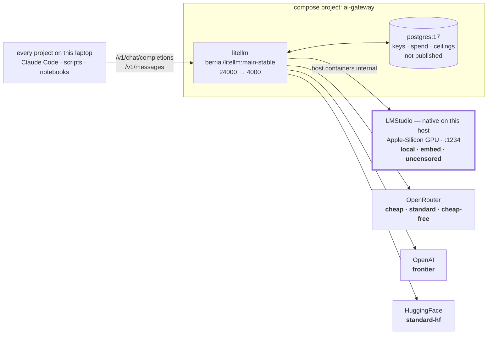
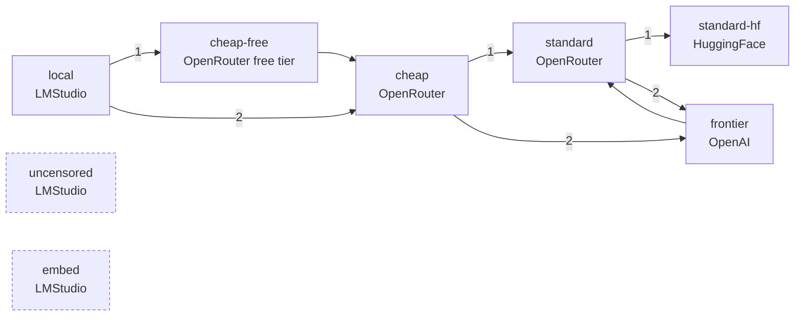

# ai-gateway

The machine-wide LLM gateway: **one OpenAI-compatible endpoint** that every project
on this laptop calls, so switching provider or model is a change *here* rather than in
each repo.

Two containers, and each is load-bearing:

| Service | Host | Notes |
|:--|:--|:--|
| `litellm` | <http://localhost:24000> | the endpoint; admin UI at [`/ui`](http://localhost:24000/ui) |
| `postgres` | *not published* | virtual keys, spend logs, budget ceilings |

Runs under both `podman compose` and `docker compose`. LMStudio runs **natively** on
the host; the gateway reaches it at `host.containers.internal` / `host.docker.internal`.

## Architecture



There is **no application code** in this repo. A change here is a change to
[`compose.yml`](compose.yml) or [`litellm/config.yaml`](litellm/config.yaml), both images
are stock, and `up -d` needs no build step.

## Start

```bash
cp .env.example .env          # first time only; leave the provider keys blank
podman compose up -d
curl -fsS http://localhost:24000/health/readiness   # -> {"status":"healthy","db":"connected"}
```

First boot takes a minute: LiteLLM runs its schema migrations against an empty database,
which is why the healthcheck has a 60 s `start_period`. "unhealthy" inside that window is
expected.

Prefer `readiness` over `liveliness` as a probe — both answer unauthenticated, but only
`readiness` reports `"db":"connected"`, and a proxy that booted without a database still
serves completions while `/key/generate` fails.

## Aliases

Call these names, never a model name — the model behind an alias is expected to change.

| Alias | Runs on | Price / 1M tokens | Context in / out | On failure |
|:--|:--|:--|:--|:--|
| `local` | LMStudio, `google/gemma-4-26b-a4b` | free (shadow-priced $0.12 / $0.35) | 253952 / 8192 | → `cheap-free` → `cheap` |
| `cheap` | OpenRouter, `google/gemma-4-26b-a4b-it` | $0.12 / $0.35 | 245760 / 16384 | → `standard` → `frontier` |
| `standard` | OpenRouter, `google/gemma-4-31b-it` | $0.14 / $0.40 | 245760 / 16384 | → `standard-hf` → `frontier` |
| `frontier` | OpenAI, `gpt-5.4-mini` | LiteLLM's built-in rate | provider default | → `standard` |
| `embed` | LMStudio, `text-embedding-nomic-embed-text-v1.5` | free | 2048 | none |
| `uncensored` | LMStudio, `gemma-4-31b-it-abliterated` | free (shadow-priced $0.14 / $0.40) | 253952 / 8192 | **none, deliberately** |

The first four are tiers — pick one per call. `embed` and `uncensored` are roles: you ask
for them because you need that *shape* of model, not that price point.

`cheap-free` and `standard-hf` also exist and are **not** part of that vocabulary — they
are fallback targets only. Every number above, and the reasoning behind it, is in
[`litellm/config.yaml`](litellm/config.yaml).

```bash
curl http://localhost:24000/v1/chat/completions \
  -H "Authorization: Bearer $LITELLM_MASTER_KEY" \
  -H 'Content-Type: application/json' \
  -d '{"model":"local","messages":[{"role":"user","content":"hi"}]}'
```

### Where a failed call goes next



Two consequences that look like bugs and are not:

- **`local` is not guaranteed to stay local.** When LMStudio is unreachable it lands on
  the same weights at OpenRouter — so a stopped LMStudio changes *where* the request ran,
  not *what* ran, but a "free" session can quietly accrue real spend. The `api_base`
  column in `/spend/logs` is how you tell after the fact.
- **`uncensored` has no chain at all.** A hosted twin would both refuse the request and
  see a prompt that was chosen to stay on this machine, so it fails instead. `embed` is
  likewise terminal.

Separately, a request that *overflows* its window falls to `frontier` rather than down the
chain above — `frontier` is the only larger window here.

## Endpoints

Verified 2026-08-21 against a running stack.

| Method | Path | Auth | What |
|:--|:--|:--|:--|
| `GET` | `/health/liveliness` | none | `"I'm alive!"` — the process is up |
| `GET` | `/health/readiness` | none | `{"status":"healthy","db":"connected"}` — **the useful probe** |
| `GET` | `/health` | master key | live per-model check; costs one call to each provider |
| `POST` | `/v1/chat/completions` | any key | the OpenAI route |
| `POST` | `/v1/messages` | any key | the Anthropic route — what Claude Code drives |
| `POST` | `/v1/embeddings` | any key | `embed`; returns 768 dims |
| `GET` | `/model/info` | master key | which aliases are actually registered |
| `POST` | `/key/generate` | master key | mint a capped key (§ below) |
| `GET` | `/key/info` | the key itself | its models, ceiling, spend and expiry |
| `GET` | `/spend/logs` | master key | every request, with `model`, `spend` and `api_base` |
| — | `/ui` | master key | admin UI; the Logs tab carries prompt and response |

## Claude Code

LiteLLM exposes `/v1/messages`, so Claude Code can drive any alias above: point
`ANTHROPIC_BASE_URL` at `http://localhost:24000` (no `/v1` suffix) and map all three
`ANTHROPIC_DEFAULT_*_MODEL` slots onto aliases — leave one unset and it sends a real
Claude model id the gateway has never heard of.

**[`NOTES.md`](NOTES.md) is the whole story**: the variable table, the three ways to apply
it, per-alias configurations, the two timeouts a local model needs, and a troubleshooting
table. Tool calling through `local` and `uncensored` is verified there with dates — a
structured `tool_use` block, not the raw-text tool syntax that makes most local models
unusable from an agent.

> Do not hand it the master key for anything longer than a try-out. That key has **no
> spending ceiling**, and `local` reaches OpenRouter when LMStudio is down — free while it
> is up, uncapped when it is not.

## Budget-capped keys

The master key mints others and **has no ceiling of its own**, so it is not what a project
should hold. Issue a capped, expiring key instead:

```bash
curl -X POST http://localhost:24000/key/generate \
  -H "Authorization: Bearer $LITELLM_MASTER_KEY" \
  -H 'Content-Type: application/json' \
  -d '{"models":["local","cheap"],"max_budget":0.50,"duration":"24h"}'
```

Check one at any time with `curl -H "Authorization: Bearer $KEY" http://localhost:24000/key/info`.

`local` is **shadow-priced** — it runs free on this machine but carries its OpenRouter
twin's rate, so spend accrues and a ceiling can actually trip. That figure is "what this
workload would cost on the cloud twin", not money anyone was billed; anything summing
`/spend/logs` has to say which it is reporting. Setting both `*_cost_per_token` values on
`local` to `0` turns it off, at the cost of ceilings no longer applying locally.

A `{"error":"No connected db."}` here means the proxy booted without `DATABASE_URL`.
Completions keep working, which is why this has to be tested rather than assumed.

## Configuration

`compose.yml` interpolates from the **shell environment first**, then `.env` — that
ordering is the whole design.

| Variable | Default | Used by |
|:--|:--|:--|
| `LITELLM_MASTER_KEY` | `sk-litellm-master` | the admin credential; mints keys, no ceiling |
| `LM_STUDIO_API_BASE` | `http://host.containers.internal:1234/v1` | `local`, `embed`, `uncensored`. Docker: `host.docker.internal` |
| `OPENROUTER_API_KEY` | *(blank by design)* | `cheap`, `standard`, `cheap-free` |
| `OPENAI_API_KEY` | *(blank by design)* | `frontier` |
| `HF_TOKEN` | *(blank by design)* | `standard-hf` |
| `DATABASE_URL` | set in `compose.yml` | **required** — without it `/key/generate` fails while completions do not |
| `MAX_STRING_LENGTH_PROMPT_IN_DB` | `100000` | LiteLLM's own default of 2048 clips agent transcripts mid-run |

The three provider keys stay blank in `.env` **on purpose**: `~/Projects/.envrc` already
exports them from `~/.secrets/secrets.enc.yaml` into every shell under `~/Projects`, and
compose reads the shell first. Writing them into `.env` anyway creates a second plaintext
copy that a rotation will not reach. See [`.env.example`](.env.example).

## LMStudio

The context limits declared in the config are only true for a model **hand-loaded** with
matching flags. A JIT-loaded model does not inherit them and gets a 1 h TTL, so it can
silently come back smaller an hour after its last request — at 8192, against an agent
prompt many times that size.

Load the model behind the alias you are about to use; they are different models:

```bash
lms load google/gemma-4-26b-a4b      --context-length 262144 --parallel 1 --gpu max  # local
lms load gemma-4-31b-it-abliterated  --context-length 262144 --parallel 1 --gpu max  # uncensored
lms ps --json    # the source of truth, not the UI
```

`--parallel 1` is deliberate, and it is the flag most likely to be "improved" wrongly. An
agent client fires its main turn and its background calls (titles, summaries) at once; at
`--parallel 4` they split one GPU four ways and everything slows together — a 1-token
request measured **34 s** while large prompts sat in front of it. Serialising is faster end
to end.

Prompt processing on this machine measures **~100 tok/s** (17.6k tokens in 173 s), so an
agent-scale prompt needs minutes before its first token. That is why the two LMStudio chat
routes carry `timeout: 3600` — and why the client's own timeout has to be raised in step,
or it hangs up first and the gateway's patience is wasted.

## Ports

`24000` is a deliberate third band. Two other stacks on this machine hold ports, and the
failure being avoided is not a loud bind error but the silent one — a health probe
against `localhost:4000` that a *different* project's gateway answers, going green.

| Stack | Band |
|:--|:--|
| `mlflow-tutorial` | 3000, 4000, 5432, 5555, 6333/4, 7233, 8080, 9090 |
| `ai-agent-platform` | 1xxxx — 14000, 15000 |
| `ai-gateway` | 2xxxx — 24000 |

Container-internal ports are unchanged; on the compose network nothing can collide.

## Troubleshooting

Claude-Code-specific symptoms are in [`NOTES.md`](NOTES.md). These are the gateway's own.

| Symptom | Cause | Fix |
|:--|:--|:--|
| `unhealthy` for the first minute after `up -d` | schema migrations against an empty database | expected — wait out the 60 s `start_period` |
| `{"error":"No connected db."}` from `/key/generate` | the proxy booted without `DATABASE_URL` | `curl /health/readiness` — it reports `db` |
| 401 from a priced alias only | the shell that ran `up -d` had no direnv, so the key interpolated blank | re-run `up -d` from a shell under `~/Projects` |
| Non-zero spend on `local` | LMStudio was down and the fallback chain ran | expected — check `api_base` in `/spend/logs` |
| `local` fails instantly, context error | LMStudio JIT-loaded it at 8192 | hand-load it — § LMStudio |
| An agent runs a step or two, executes nothing, exits cleanly | tool calls returned as raw text by the wrong OpenRouter free-tier provider | the provider pin in `litellm/config.yaml` — check it is intact |
| A health probe is green but nothing works | it probed `localhost:4000`, which another stack answers | § Ports |
| `Engine protocol predict request failed: fetch failed` in the logs | a timeout fired mid-prompt and tore down LMStudio's engine socket; it maps to a 400, and a 400 is never retried | raise **both** timeouts — § LMStudio |

Every request lands in the admin UI's Logs tab at <http://localhost:24000/ui>, prompt and
response included. Look there before changing configuration.

## Repository structure

```text
ai-gateway/
├── .claude/            the contract this repo is maintained under
├── .env.example        tracked; the three provider keys are blank BY DESIGN
├── .gitignore
├── compose.yml         two services, ports, healthchecks, env wiring
├── litellm/
│   └── config.yaml     aliases, prices, fallback chains, provider pins
├── NOTES.md            connecting Claude Code to this gateway
└── README.md           start here — aliases, endpoints, keys, ports
```

## What this repo deliberately does not run

- **No trace store.** MLflow is a *project's* system of record for "did this get better";
  two projects sharing one experiment namespace makes that question ambiguous.
  `success_callback` is empty — trace client-side, or point a callback at your own server.
- **No custom image.** The stock `ghcr.io/berriai/litellm:main-stable` needs no build.
  A `litellm/Dockerfile` returns the day a callback needs a package it lacks.
- **No secrets.** They arrive from the shell, never from this repo — § Configuration.
- **No test suite.** There is nothing to unit-test in two stock images and a YAML file.
  Verification is `/health/readiness` plus one real completion through the alias you
  touched.

Derived from `~/Projects/Github/lukaskellerstein/ai-agent-platform/deploy/compose`, minus
its trace store and its `judge` / `optimizer` role aliases.
