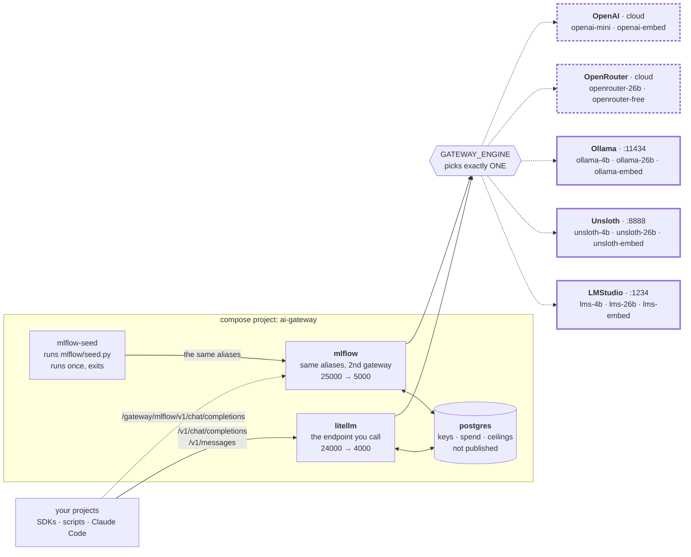

# ai-gateway

**One OpenAI-compatible endpoint in front of every model on your machine.**

Your projects call `http://localhost:24000` and ask for a name like `lms-4b` or `ollama-4b`.
Which model that name points at is decided **here**, in this repo's config — so swapping a
model is one edit here, not an edit in every project that calls it.

```bash
curl http://localhost:24000/v1/chat/completions \
  -H "Authorization: Bearer sk-litellm-master" \
  -H 'Content-Type: application/json' \
  -d '{"model":"lms-4b","messages":[{"role":"user","content":"hi"}]}'
```

It supports five engines: **LMStudio, Unsloth Studio and Ollama** on your own machine, and
**OpenRouter and OpenAI** in the cloud. An engine is an engine — the alias prefix says which
is which, and `openrouter-26b` is the same weights as `lms-26b` on hardware you do not own.

**One engine runs at a time**, and one word in `.env` picks it. That engine serves two or
three aliases — a small chat model, a large one, an embedder — on both gateways. To compare
two engines, change the word and `up -d` again: the names differ only in the prefix.

## What you get

- **One endpoint, many models.** The OpenAI routes plus `/v1/messages` (the Anthropic
  route), so the OpenAI SDK, the Anthropic SDK and Claude Code all reach the same models.
- **Five engines, one vocabulary.** `lms-26b`, `unsloth-26b`, `ollama-26b` and
  `openrouter-26b` are the same weights on four engines. Change one word, measure the engine.
- **Spend limits that work on local models too.** Virtual keys carry a budget and an expiry.
  Local routes are *shadow-priced*, so a ceiling still trips even though nothing is billed.
- **A free alias can never bill you.** No alias falls back to another, so a request costs
  money only when a caller asks for a route that costs money.
- **Every request logged** — prompt and response — in the admin UI at
  <http://localhost:24000/ui>.
- **No build step.** All three images are stock. `up -d` is the whole install.

> **The models below are examples, not the product.** They are what one machine happens to
> have on disk. The alias names are the contract; edit the config for your engine —
> [`litellm/lms.yaml`](litellm/lms.yaml) **and** [`mlflow/lms.py`](mlflow/lms.py) — to point
> them at your own models, then run `docker compose up -d` again.

## How it works



**Exactly one engine is live at a time** — the dashed edges are the four that are not. Solid
borders are on this machine and free; dashed borders are hosted and **billed**. With a local
engine selected, the running gateway has no hosted route at all: not a disabled one, an absent
one. There are no fallback chains either, so picking the engine is the only decision that can
cost money.

`litellm` is the endpoint every project calls; `postgres` holds its virtual keys, spend logs
and budget ceilings, and publishes no port. `mlflow` serves the **same alias names** through
the MLflow AI Gateway, so the two can be compared without changing a caller. `mlflow-seed`
writes MLflow's endpoints in over the API and exits — **exited (0) is its finished state**.

**Each gateway owns its own alias list** — YAML in `litellm/`, Python in `mlflow/`, neither
reading the other — so either can be deleted and the other still serves. The price is that
**adding an alias is two edits**, the one rule in [Contributing](#contributing).

The three local engines run **natively on the host**: they need the GPU. The containers reach
them at `host.containers.internal` / `host.docker.internal`, and `compose.yml` declares both
so Docker and Podman behave the same. The two hosted engines need only a key in your shell.

## Quick start

You need `docker compose` or `podman compose` — **the two are drop-in replacements here**, so
swap the word and nothing else changes — and at least one local engine on the host:
[LMStudio](https://lmstudio.ai), [Ollama](https://ollama.com) or
[Unsloth Studio](https://unsloth.ai). With no local engine at all, use an OpenRouter or OpenAI
key and `GATEWAY_ENGINE=openrouter`.

```bash
cp .env.example .env            # NOT optional. It ships GATEWAY_ENGINE=lms and both profiles
docker compose up -d            # first boot takes ~60 s: LiteLLM runs schema migrations

curl -fsS http://localhost:24000/health/readiness   # -> {"status":"healthy","db":"connected"}
curl -fsS http://localhost:25000/health             # -> OK
docker compose logs mlflow-seed                     # what it built in MLflow
```

> **Copy `.env.example` first, or nothing but `postgres` starts.** Both gateways sit behind
> compose profiles, and a service with a profile does not start until its profile is named.
> For one command instead of a permanent choice, pass `--profile litellm --profile mlflow`.

Then get the models for **the one engine you selected** — three each, and you need no others.
The commands are in that engine's config file, which also carries every trap it has:
[`litellm/lms.yaml`](litellm/lms.yaml), [`litellm/unsloth.yaml`](litellm/unsloth.yaml),
[`litellm/ollama.yaml`](litellm/ollama.yaml). The hosted engines download nothing.

Everything here is measured on an Apple-Silicon MacBook with 128 GB of RAM.

## The aliases

Call these names, never a model name.

**Every alias names its engine** — `lms-*` is LMStudio, `unsloth-*` is Unsloth, `ollama-*` is
Ollama, `openrouter-*` is OpenRouter, `openai-*` is OpenAI. There is deliberately no
engine-neutral name and no capability name, so a caller always knows which engine answered
and, just as importantly, **who is being billed**. The first three are this machine and free;
the last two are the cloud and cost money.

|  | LMStudio (`:1234`) | Unsloth (`:8888`) | Ollama (`:11434`) | OpenRouter | OpenAI |
|:--|:--|:--|:--|:--|:--|
| **Chat, small** | `lms-4b` | `unsloth-4b` | `ollama-4b` | — | `openai-mini` |
| **Chat, large** | `lms-26b` | `unsloth-26b` | `ollama-26b` | `openrouter-26b` | — |
| **Embed** | `lms-embed` | `unsloth-embed` | `ollama-embed` | — | `openai-embed` |
| **Extra** | — | — | — | `openrouter-free` | — |
| **Costs** | free | free | free | **paid** | **paid** |

That is every alias this repo defines. `GATEWAY_ENGINE` selects **one column**, so the
gateway serves two or three names at a time — never the whole table. The rows are the point:
the same model sits across a row, so changing the engine word and re-running the tests
measures the engine and nothing else. You do not need every engine — name the one you have,
and the rest are not in the config at all.

| Alias | Model | Input | Build | Notes |
|:--|:--|--:|:--|:--|
| `lms-4b` | `google/gemma-4-e4b` | 122880 | QAT | tools and vision both work |
| `lms-26b` | `google/gemma-4-26b-a4b-qat` | 253952 | QAT | 26B MoE, ~4B active |
| `lms-embed` | `text-embedding-nomic-embed-text-v1.5` | 2048 | Q4_K_M | 768 dims, 84 MB |
| `unsloth-4b` | `unsloth/gemma-4-E4B-it-qat-GGUF` | 122880 | QAT | same weights as `lms-4b` |
| `unsloth-26b` | `unsloth/gemma-4-26B-A4B-it-qat-GGUF` | 253952 | QAT | same weights as `lms-26b`; **it reasons and `lms-26b` does not** |
| `unsloth-embed` | `second-state/Nomic-embed-text-v1.5-Embedding-GGUF` | 2048 | Q8_0 | 768 dims |
| `ollama-4b` | `gemma4:e4b` | 122880 | **Q4_K_M** | not QAT — see below |
| `ollama-26b` | `gemma4:26b` | 253952 | **Q4_K_M** | not QAT |
| `ollama-embed` | `nomic-embed-text` | 2048 | **F16** | 768 dims, the heaviest of the three |
| `openrouter-26b` | `google/gemma-4-26b-a4b-it` | 245760 | not stated | **$0.07 · $0.34** per 1M in·out |
| `openrouter-free` | `google/gemma-4-26b-a4b-it:free` | 229376 | not stated | free, rate-limited, **not on 25000** |
| `openai-mini` | `gpt-5.4-mini` | — | — | **paid**; no vision |
| `openai-embed` | `text-embedding-3-small` | 8191 | — | **paid**, 1536 dims |

Builds measured 2026-08-31 with `lms ls --json` and `ollama show`; the Unsloth figure is the
one its model card states.

`Input` is the usable prompt window: the model's context minus an output reserve — 8192 tokens
on the local routes, larger on the two OpenRouter ones. E4B caps at 131072, hence 122880.
`openai-embed`'s 8191 is the model's own limit, not a subtraction.

### Two traps when you pick an alias

- **Thinking models spend the reply's budget on thinking, and you cannot guess which ones
  do.** Reasoning tokens come out of the same `max_tokens` allowance as the answer, so a
  ceiling set too low returns **empty content**, `finish_reason: "length"`, and no error at
  all. It is decided **per model and engine**: `unsloth-26b` emits a reasoning block while
  `lms-26b` on identical weights does not (2026-08-27), and `lms-4b` spent 65 of 70 completion
  tokens reasoning (2026-08-28). Treat every chat alias as capable of it. **On port 25000 this
  is your job** — MLflow cannot store a per-route `max_tokens`, so the caller must send one.
- **Embedding vectors do not mix across models — or across *builds* of one model.** All three
  local embedders are nomic v1.5 at 768 dims in a **different build**: Q4_K_M on LMStudio,
  Q8_0 on Unsloth, F16 on Ollama. `openai-embed` is a different model at 1536 dims. A query
  embedded with one, matched against an index built with another, returns quietly worse
  neighbours and never errors. Use one alias per index and record which.

### The two hosted engines

`openrouter` and `openai` are engines like the three local ones — one file per gateway, named
by `GATEWAY_ENGINE` — and differ in one way that is not architectural: **they bill a real
account**. Turn one on with `GATEWAY_ENGINE=openrouter` and the matching key exported. Three
things to know:

- **Do not remove the provider pin on `openrouter-free`.** It carries
  `order: ["google-ai-studio"]` and `allow_fallbacks: false`
  ([`litellm/openrouter.yaml`](litellm/openrouter.yaml)), because OpenRouter load-balances its
  free tier and one provider returns tool calls as **raw text** with `tool_calls` absent.
  Nothing errors: your agent sees a message with no tool calls, executes nothing, and stops.
  `allow_fallbacks: false` is half the pin — without it OpenRouter reroutes exactly when the
  pinned provider is busy. The price is a 429 when Google AI Studio is at its limit: a visible
  failure over an invisible one.
- **`openrouter-free` is therefore absent on port 25000.** MLflow has no `extra_body`, so it
  cannot carry the pin, and an unpinned copy would look like LiteLLM's route while carrying
  the failure the pin exists to stop. It is the one alias that 404s on 25000 by design.
- **On the OpenAI routes, send `max_completion_tokens`, not `max_tokens`.** The gpt-5 family
  rejects `max_tokens` outright. LiteLLM translates it, so 24000 accepts either; MLflow
  forwards parameters exactly as sent, so the same body 400s on 25000 (verified 2026-08-31).
  `max_completion_tokens` works on both.

## Call it

Any OpenAI-compatible client works. Point `base_url` at `http://localhost:24000/v1`.

```python
from openai import OpenAI

client = OpenAI(base_url="http://localhost:24000/v1", api_key="sk-litellm-master")

r = client.chat.completions.create(
    model="lms-4b",                                    # an alias, not a model id
    messages=[{"role": "user", "content": "hi"}],
)
print(r.choices[0].message.content)
```

| Method | Path | Auth | What |
|:--|:--|:--|:--|
| `POST` | `/v1/chat/completions` | any key | the OpenAI route |
| `POST` | `/v1/messages` | any key | the Anthropic route — what Claude Code drives |
| `POST` | `/v1/embeddings` | any key | the running engine's `*-embed` alias |
| `GET` | `/health/readiness` | none | `{"status":"healthy","db":"connected"}` — **the probe to use** |
| `GET` | `/health/liveliness` | none | `"I'm alive!"` — the process is up, nothing more |
| `GET` | `/health` | master key | live per-model check; costs one call to each provider |
| `GET` | `/model/info` | master key | which aliases are actually registered |
| `POST` | `/key/generate` | master key | mint a capped key ([below](#budget-capped-keys)) |
| `GET` | `/key/info` | the key itself | its models, ceiling, spend and expiry |
| `GET` | `/spend/logs` | master key | every request, with `model`, `spend` and `api_base` |
| — | `/ui` | master key | admin UI; the Logs tab carries prompt and response |

## Tests

[`tests/`](tests/) drives **both** gateways with the real OpenAI client — same alias, same
message body, different `base_url`. That is the claim this repo makes, so that is what gets
checked, and it is the cheapest way to catch the two alias lists drifting apart.

```bash
cd tests
uv sync                                     # once
uv run run_all.py                           # 3 scripts x 2 gateways = 6 rows

uv run run_all.py --model ollama-4b         # any alias
uv run 02_tools_call.py --gateway litellm   # one script, one gateway
```

```text
model=lms-4b  gateways=litellm, mlflow

PASS  01_simple_call.py      litellm     1.7s      # a plain completion, and a second turn
PASS  02_tools_call.py       mlflow      1.5s      # a STRUCTURED tool_calls reply
PASS  03_multimodal.py       litellm     3.0s      # an image as a base64 data: URL
...
6/6 passed
```

Every script prints the full response, so each doubles as a sample to copy from; exit code is
`1` on any failure. **The default alias follows `GATEWAY_ENGINE`** — `lms-4b`, `unsloth-4b`,
`ollama-4b` or `openrouter-26b`, whichever engine is running, each being the one route on that
engine that is both vision- and tool-capable. The gateways follow `COMPOSE_PROFILES` the same
way: a stack running only MLflow gets three rows, not six. `openai` has no default on purpose,
because `gpt-5.4-mini` has no vision.

**This suite is how you compare engines.** Run it, change `GATEWAY_ENGINE`, `up -d`, run it
again: the `-26b` aliases are the same weights on four engines, so the difference is the
engine.

Verified 2026-08-31: 6/6 on `ollama-4b` and on `openrouter-26b`. Verified 2026-08-28: 6/6 on
`lms-4b`, the run shown above. What is deliberately not covered is in
[`tests/README.md`](tests/README.md).

## Use it from Claude Code

Claude Code speaks the Anthropic Messages API and nothing else. LiteLLM exposes
`/v1/messages` and translates it to whatever the alias points at, so Claude Code can drive
any model here and never learns it is not talking to Anthropic.

| Variable | Value | Why |
|:--|:--|:--|
| `ANTHROPIC_BASE_URL` | `http://localhost:24000` | **No `/v1` suffix** — Claude Code appends `/v1/messages` itself |
| `ANTHROPIC_AUTH_TOKEN` | a gateway key | sent as `Authorization: Bearer` |
| `ANTHROPIC_API_KEY` | the same value | sent as `x-api-key`. Set both; which one is used has moved between versions |
| `ANTHROPIC_DEFAULT_SONNET_MODEL` | an alias | what `/model sonnet` resolves to |
| `ANTHROPIC_DEFAULT_OPUS_MODEL` | an alias | what `/model opus` resolves to |
| `ANTHROPIC_DEFAULT_HAIKU_MODEL` | an alias | background work — titles, summaries, suggestions |
| `CLAUDE_CODE_DISABLE_EXPERIMENTAL_BETAS` | `1` | beta headers a non-Anthropic backend does not implement |
| `API_TIMEOUT_MS` | `3600000` | the default expires while a local model is still reading the prompt |
| `CLAUDE_CODE_MAX_CONTEXT_TOKENS` | the alias's `Input` figure | without it Claude Code assumes 200000 for every alias |

```bash
ANTHROPIC_BASE_URL="http://localhost:24000" \
ANTHROPIC_API_KEY="$AI_GATEWAY_KEY" \
ANTHROPIC_AUTH_TOKEN="$AI_GATEWAY_KEY" \
ANTHROPIC_DEFAULT_SONNET_MODEL="lms-4b" \
ANTHROPIC_DEFAULT_OPUS_MODEL="lms-4b" \
ANTHROPIC_DEFAULT_HAIKU_MODEL="lms-4b" \
CLAUDE_CODE_DISABLE_EXPERIMENTAL_BETAS=1 \
API_TIMEOUT_MS=3600000 \
CLAUDE_CODE_MAX_CONTEXT_TOKENS=122880 \
claude
```

The same keys go in a `.claude/settings.json` `env` block if you want them to persist. Two
warnings about that file: **never commit a gateway key into it**, and an `env` block there
silently overrides anything you set on the command line.

Three traps, in the order people hit them:

1. **Set all three model variables.** Leave one unset and Claude Code sends a real Claude
   model id, which this gateway has never heard of:
   `Invalid model name passed in model=claude-...`. It looks like a broken proxy and is just
   an unmapped slot.
2. **Raise both timeouts, or neither matters.** Prompt processing measures ~100 tok/s here
   (17.6k tokens in 173 s), and Claude Code re-sends its system prompt and every tool schema
   each turn — so a real agent turn needs **5–15 minutes before the first token**. The
   gateway already carries `timeout: 3600` on every local route; if the client hangs up
   first, that patience is wasted.
3. **Never pick the `[1m]` variant in `/model`.** It forces a 1.0M window unconditionally and
   ignores `CLAUDE_CODE_MAX_CONTEXT_TOKENS`, so auto-compact never fires in time.

**Tool calling works on all three default aliases.** `lms-4b`, `unsloth-4b` and `ollama-4b`
each returned a structured `tool_calls` reply on both gateways — verified 2026-08-27, and
re-verified on `ollama-4b` 2026-08-31 — not the raw-text tool syntax that makes most local
models useless from an agent. Those runs go through the OpenAI route; `tests/` cannot drive
`/v1/messages`, so check a real Claude Code turn yourself before trusting an alias with agent
work. **Stay on 24000**: MLflow's Anthropic passthrough exists only for Anthropic-provider
endpoints, and every alias here is OpenAI-protocol.

## Budget-capped keys

The master key mints other keys and **has no ceiling of its own**, so it is not what a
project should hold. Issue a capped, expiring key instead, and check it with
`curl -H "Authorization: Bearer $KEY" http://localhost:24000/key/info`.

```bash
curl -X POST http://localhost:24000/key/generate \
  -H "Authorization: Bearer $LITELLM_MASTER_KEY" \
  -H 'Content-Type: application/json' \
  -d '{"models":["lms-4b","lms-embed"],"max_budget":0.50,"duration":"24h"}'
```

Local routes are **shadow-priced**: free on your machine, but carrying a cloud twin's rate so
spend accrues and a ceiling can actually trip. That figure is "what this workload would cost in
the cloud", not money anyone was billed — anything summing `/spend/logs` has to say which of
the two it reports. Setting both `*_cost_per_token` values to `0` turns it off, at the cost of
ceilings no longer applying locally.

## Configuration

Two lines in `.env` decide what runs, and they are independent. `compose.yml` interpolates
from the **shell environment first**, then `.env`.

```bash
# only Ollama, only the MLflow gateway
COMPOSE_PROFILES=mlflow
GATEWAY_ENGINE=ollama
```

**Which gateway.** `COMPOSE_PROFILES` is compose's own variable. `litellm` is the primary
endpoint — virtual keys, spend logs, budget ceilings and `/v1/messages`. `mlflow` is the
second gateway on 25000, with no key and a trace per request.

**Which engine.** One word, one engine. There is **no list, no `all`, and no separate switch
for the cloud** — a hosted provider is an engine like any other, and the alias prefix already
says which is which. That word names one file per gateway, `litellm/<engine>.yaml` and
`mlflow/<engine>.py`. There is no generated config and no composed-file matrix: what you read
is what LiteLLM loads.

> Changing the word leaves the **old** endpoints behind on the MLflow gateway, still answering
> on port 25000 after LiteLLM has stopped serving them. Run
> `docker compose run --rm mlflow-seed python /app/mlflow/seed.py --prune` when that matters —
> and read that file's header first, because it deletes **every other engine's** endpoints.

| Variable | Default | Used by |
|:--|:--|:--|
| `COMPOSE_PROFILES` | *(none)* | **which gateway runs** — `litellm`, `mlflow`, `litellm,mlflow` or `all`. **With it unset, only `postgres` starts** |
| `GATEWAY_ENGINE` | `lms` | **which engine both gateways serve** — one of `lms`, `unsloth`, `ollama`, `openrouter`, `openai`. Not a list. A typo stops both gateways: `mlflow-seed` exits 2 naming the valid five, and `litellm` crash-loops on a file that does not exist |
| `LITELLM_MASTER_KEY` | `sk-litellm-master` | the admin credential. **Change it for anything but a laptop** |
| `LM_STUDIO_API_BASE` | `http://host.containers.internal:1234/v1` | every `lms-*` alias |
| `UNSLOTH_API_BASE` | `http://host.containers.internal:8888/v1` | every `unsloth-*` alias |
| `UNSLOTH_API_KEY` | *(blank)* | **required** by every `unsloth-*` alias — Unsloth 401s every route without it |
| `OLLAMA_API_BASE` | `http://host.containers.internal:11434/v1` | every `ollama-*` alias. **There is no `OLLAMA_API_KEY`**: Ollama ignores the header. Both gateways still set a literal `sk-ollama` — LiteLLM's `openai/` provider needs some key string, and the MLflow seed skips any endpoint whose key is empty |
| `OPENROUTER_API_KEY` | *(blank)* | every `openrouter-*` alias. **Real spend.** Without it LiteLLM keeps the alias and 401s while the MLflow seed skips it — so the name 401s on 24000 and 404s on 25000 |
| `OPENAI_API_KEY` | *(blank)* | every `openai-*` alias. **Real spend**, and the same two-way failure without it |
| `HF_TOKEN` | *(blank)* | **nothing, now.** It only ever backed a fallback target, and no alias has a fallback chain. The line stays because compose still passes it through |
| `MLFLOW_CRYPTO_KEK_PASSPHRASE` | *(blank)* | wraps the key encrypting MLflow's stored credentials. Blank is supported. **Change it later and they stop decrypting** — the repair is `up -d`, which rewrites them |
| `MLFLOW_GATEWAY_ROUTE_TIMEOUT_SECONDS` | `3600` | MLflow's own default is 300 s, which gives up mid-prompt on a local model |
| `MLFLOW_SERVER_ALLOWED_HOSTS` | set in `compose.yml` | must list `mlflow:5000` and `0.0.0.0:5000`, or in-stack calls get 403 while `/health` still says `OK` |
| `DATABASE_URL` | set in `compose.yml` | **required** — without it `/key/generate` fails while completions keep working |
| `MAX_STRING_LENGTH_PROMPT_IN_DB` | `100000` | LiteLLM's own default of 2048 clips agent transcripts mid-run |

The defaults name `host.containers.internal`, which is Podman's name. Docker resolves it too
because `compose.yml` declares both — but write `host.docker.internal` if you override these.

The provider keys stay blank in `.env` on purpose when your shell already exports them from an
encrypted store: compose reads the shell first, so no second plaintext copy exists to go stale
after a rotation. Fill them in only if you have no such setup — see
[`.env.example`](.env.example).

## Load a model first

The context limits above are only true for a model loaded with matching flags. Each engine
fails differently when the model is not there, and **only Ollama fails loudly**:

| | LMStudio (1234) | Unsloth (8888) | Ollama (11434) |
|:--|:--|:--|:--|
| Key | any string | **required** — every route 401s | ignored entirely |
| Model not loaded | JIT-loads it, quietly at 8192 context | `400 No model loaded`, unless auto-switch is on | loads it, at the model's own context |
| Models held at once | several | **one**, chat and embedder alike — a new request unloads the last | several |
| Idle eviction | 1 h TTL on a JIT load | none — it holds until the next swap | **5 minutes**, by default |
| Reasoning on Gemma 4 | **depends on the model** — off on the 26B, on for E4B | **on** | **on** |
| Build pulled here | QAT | QAT | **Q4_K_M** |
| Source of truth | `lms ps --json` | `GET /v1/status`, with the key | `ollama ps` |

**LMStudio is the dangerous one.** It JIT-loads a model that is not resident, and a JIT load
does **not** inherit hand-load flags: a model you loaded at 262144 comes back at **8192**,
with a 1 h TTL. So a session that worked this morning fails this afternoon with nothing
changed, and the error looks like a gateway bug.

Each engine's config file carries its own load commands and every trap it has, next to the
aliases they apply to — [`litellm/lms.yaml`](litellm/lms.yaml),
[`litellm/unsloth.yaml`](litellm/unsloth.yaml), [`litellm/ollama.yaml`](litellm/ollama.yaml).
Read the one you are running.

## The MLflow gateway

The second gateway: the same alias names at <http://localhost:25000>, so the two can be
compared on one machine without changing a caller's vocabulary. Swap the base URL, keep the
model name. **LiteLLM stays the primary endpoint** — it is the only one with virtual keys,
spend logs and budget ceilings, and there is **no key on this one at all**, which is why it
binds localhost only.

```bash
curl -sX POST http://localhost:25000/gateway/mlflow/v1/chat/completions \
  -H 'Content-Type: application/json' \
  -d '{"model":"lms-4b","messages":[{"role":"user","content":"hi"}]}'
```

Embeddings use a different path here, `/gateway/openai/v1/embeddings`.

### It has no config file, so its config is Python

MLflow's endpoints live in the database and arrive over an API — there is no file to mount. So
this gateway's alias list is **Python**, split exactly the way LiteLLM's YAML is: one file per
engine (`lms.py`, `unsloth.py`, `ollama.py`, `openrouter.py`, `openai.py`), each a plain list
of `Endpoint(...)` entries with the reasoning beside them. `gateway.py` holds the API calls,
written once; `seed.py` reads `GATEWAY_ENGINE` and loads the one file it names.

`mlflow-seed` runs `seed.py` on every `up -d`, and it is idempotent. **Run it by hand through
compose, not on the host** — it imports `mlflow`, which the image ships and your laptop
probably does not, so on the host it fails with `ModuleNotFoundError` before reading a single
argument.

```bash
docker compose run --rm mlflow-seed python /app/mlflow/seed.py --help
docker compose run --rm mlflow-seed python /app/mlflow/seed.py --engine ollama --reset
```

`--reset` rebuilds every endpoint the run names. `--prune` deletes the ones it does not, and
that includes every other engine's — read that file's header before reaching for it.

You also get **traces for free**: each request becomes an MLflow trace in an auto-created
`gateway/<alias>` experiment, written after the response.

Verified 2026-08-31: the two alias lists match on all five engines, with the single deliberate
exception of `openrouter-free`. What does **not** transfer, and why LiteLLM stays primary:

| In LiteLLM | In MLflow |
|:--|:--|
| `/v1/messages` (the Anthropic route) | **Not available** — the passthrough exists only for Anthropic-provider endpoints. Claude Code therefore stays on 24000 |
| Virtual keys, `/key/generate`, `/spend/logs` | No equivalent. Budget policies cap **per endpoint**, not per caller, and there is no key to hand a project |
| Per-token pricing | Not carried across, so no shadow pricing |
| `max_input_tokens` + pre-call checks | No equivalent — an over-long prompt fails at the model instead of before the call |
| `drop_params` | No equivalent; every parameter is forwarded exactly as sent — which is why the OpenAI routes need `max_completion_tokens` here and accept `max_tokens` on 24000 |
| `extra_body` (OpenRouter's provider pin) | No equivalent, so **`openrouter-free` is absent here on purpose** |
| `timeout` per route | One global `MLFLOW_GATEWAY_ROUTE_TIMEOUT_SECONDS` instead |

## Troubleshooting

Every request lands in the admin UI's Logs tab at <http://localhost:24000/ui>, prompt and
response included. **Look there before changing configuration.**

| Symptom | Cause | Fix |
|:--|:--|:--|
| `unhealthy` for the first minute after `up -d` | schema migrations against an empty database | expected — wait out the 60 s `start_period` |
| `{"error":"No connected db."}` from `/key/generate` | the proxy booted without `DATABASE_URL` | `curl /health/readiness` — it reports `db` |
| A local alias fails instantly with a context error | LMStudio JIT-loaded it at 8192 | hand-load it — [above](#load-a-model-first) |
| Empty content, `finish_reason: "length"` | a thinking model spent the whole `max_tokens` on reasoning | raise `max_tokens` on the call |
| `400 No model loaded` from `unsloth-*` | Unsloth serves one model at a time and auto-switch is off | turn on `Settings → API → Model auto-switch` |
| `unsloth-*` 401s on 24000 **and** 404s on 25000 | `UNSLOTH_API_KEY` was blank when `up -d` ran | export it, run `up -d` again |
| An `ollama-*` call that was fast a few minutes ago is slow again | Ollama evicted the idle model | expected — `ollama ps`, or raise `OLLAMA_KEEP_ALIVE` |
| `ollama-*` says `model not found` | the tag is not pulled | `ollama pull <tag>` — the ids are in `litellm/ollama.yaml` |
| `ollama-4b` and `lms-4b` differ in quality | not the same build: Q4_K_M here, QAT there | expected — see [Load a model first](#load-a-model-first) |
| An alias answers on 24000 and 404s on 25000 | `openrouter-free` does this **by design**. Otherwise you added it to `litellm/` only, or `mlflow-seed` has not run since | `docker compose up -d`; if the name is not in the seed's log, add the `Endpoint(...)` to `mlflow/<engine>.py` |
| An alias answers on **25000** but 400s on 24000 with `Invalid model name` | you changed `GATEWAY_ENGINE` and MLflow kept the previous engine's endpoints — it never deletes without `--prune` | `seed.py --prune`, after reading that file's header. Verified 2026-08-31 |
| `up -d` starts **only `postgres`**; both ports refuse the connection | `COMPOSE_PROFILES` is missing from `.env` | `cp .env.example .env`, or pass `--profile` on the command line |
| One port answers and the other refuses the connection | that gateway's profile is not in `COMPOSE_PROFILES` — which may be what you asked for | `docker compose ps`; add the profile if you wanted both |
| `mlflow-seed` exits 2 and `litellm` restarts in a loop | `GATEWAY_ENGINE` is misspelled, or is an old value like `all` | `docker compose logs mlflow-seed` — it names the bad word and the five valid ones |
| An alias 404s on **both** ports after you changed `GATEWAY_ENGINE` | you are calling another engine's alias — only one engine is served at a time | `curl /model/info` for the names this engine serves |
| `mlflow-seed` shows as exited | it is a one-shot; exit 0 is the finished state | expected — `docker compose logs mlflow-seed` |
| `Engine protocol predict request failed: fetch failed` | a timeout fired mid-prompt and tore down the engine socket; it maps to a 400, and a 400 is never retried | raise **both** the client and the route timeout |
| An agent runs a step or two, executes nothing, exits cleanly | tool calls came back as raw text from the wrong OpenRouter free-tier provider | check the provider pin in `litellm/openrouter.yaml` |
| MLflow answers 403 `Invalid Host header` | the caller's `Host` is not in `MLFLOW_SERVER_ALLOWED_HOSTS`, and `/health` is exempt so the container still looks healthy | add that `host:port` |
| Every MLflow alias fails on auth, LiteLLM is fine | `MLFLOW_CRYPTO_KEK_PASSPHRASE` changed, so stored secrets no longer decrypt | `docker compose up -d` — the seed rewrites them |
| A health probe is green but nothing works | it probed a port another stack answers | this repo uses **24000 / 25000** on purpose, leaving the usual 4000 / 5000 free |

## Repository layout

```text
ai-gateway/
├── compose.yml                 four services, profiles, ports, healthchecks, env wiring
├── .env.example                tracked; the key lines are blank BY DESIGN
├── litellm/                    gateway 1's alias list — YAML
│   ├── settings.yaml           the three settings blocks; NO aliases
│   └── <engine>.yaml           lms · unsloth · ollama · openrouter · openai
│                                each includes settings.yaml and declares its aliases
├── mlflow/                     gateway 2's alias list — Python; reads nothing above
│   ├── gateway.py              the MLflow API machinery, written once
│   ├── seed.py                 the entry point; picks the one engine and writes
│   └── <engine>.py             the same five names, an ENDPOINTS list each
├── postgres/init-databases.sh  creates the `mlflow` database, on a fresh volume only
├── tests/                      a uv project: 3 call kinds x both gateways
└── .claude/                    the working contract for AI agents in this repo
```

`litellm/<engine>.yaml` is where the numbers live — every one carries a comment saying where
it came from — and `mlflow/<engine>.py` is the same aliases again, for the other gateway.

## Design decisions

- **One engine at a time, and no mechanism to select more.** The alternative was a list, which
  needs something to turn that list into LiteLLM's single `--config` file — eight composed
  files, then a generator script, both of which existed and both of which are gone. One word
  in a filename needs neither. The cost is that comparing two engines is a restart rather than
  a second alias; the gain is that the whole selection mechanism is a filename.
- **Two or three aliases per engine, and no more.** A small chat model, a large one, an
  embedder. There was a twenty-alias list with a size ladder and role names; it was deleted on
  2026-08-31, because a gateway is useless until the models are on disk, and the ladder was
  documentation of one laptop rather than a thing anyone else could run.
- **Every alias names its engine.** `local` existed and hid which engine answered; `cheap`,
  `standard` and `frontier` existed and hid who was **billed**. Both were removed for the same
  reason — a name should answer the question you would otherwise have to go and look up.
- **No alias falls back to another.** A chain would be more resilient and would break the two
  things this repo is for: a comparison stops being a comparison the moment a request can
  silently run somewhere else, and a free session can silently become a paid one.
- **No trace store for other projects.** MLflow here traces only what passes through its own
  endpoints; `success_callback` is empty on purpose, because two projects sharing one
  experiment namespace makes "did this get better" ambiguous. Trace client-side instead.
- **Ports 24000 / 25000.** The failure worth avoiding is not a loud bind error but the silent
  one — a health probe against `localhost:4000` that a *different* stack answers, going
  green. Container-internal ports are unchanged.

## Contributing

Issues and pull requests are welcome. Most changes here are an alias — a model you run that
this repo does not name yet — and there is one rule that catches everyone:

> **An alias is two edits, one per gateway.** Add it to `litellm/<engine>.yaml` and to
> `mlflow/<engine>.py`. Do one and the name answers on 24000 and 404s on 25000, with
> nothing in either log to say why.

1. Fork, then branch — `git checkout -b feature/my-alias`.
2. Edit that engine's file — `litellm/<engine>.yaml`. Keep it to two or three aliases: a
   small chat model, a large one, an embedder. That shape is the point.
3. Do the same in `mlflow/`, and add the name to the alias table in this file.
4. Prove it on **both** ports — `docker compose up -d`, then
   `cd tests && uv sync && uv run run_all.py --model <your-alias>`.
5. Open a pull request saying which engines, models and machine you ran it against.

**There is no CI.** `tests/` is the whole check, and it only runs against models on your own
disk — so the pull request has to carry that evidence itself. Numbers in the config get a
comment saying where they came from; a claim in this file gets the date it was verified.

The working contract for AI coding agents in this repo is [`.claude/`](.claude/), and it is
worth a read before a larger change.

## License

[MIT](LICENSE).
