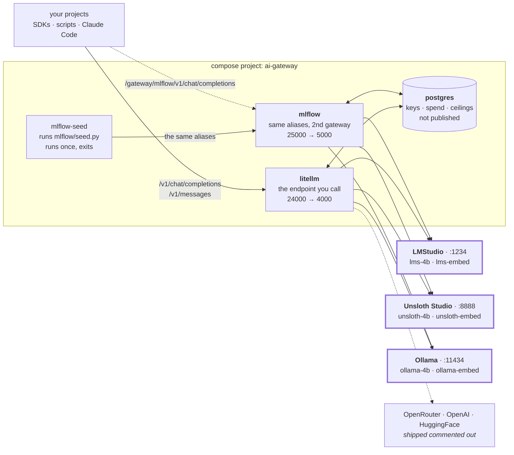

# ai-gateway

[](LICENSE)
[](https://github.com/BerriAI/litellm)
[](https://mlflow.org)
[](https://www.postgresql.org)
[](compose.yml)
[](#quick-start)

**One OpenAI-compatible endpoint in front of every model on your machine.**

Your projects call `http://localhost:24000` and ask for a name like `lms-4b` or `ollama-4b`.
Which model that name points at is decided **here**, in this repo's config — so swapping a
model is one edit here, not an edit in every project that calls it.

It runs three local engines side by side — LMStudio, Unsloth Studio and Ollama — behind the
same vocabulary, so you can compare them by changing one string. Out of the box it serves
**six aliases**: one chat model and one embedder on each engine. Hosted providers
(OpenRouter, OpenAI, HuggingFace) plug in the same way and ship commented out.

Three lines in `.env` decide what runs — **which gateway**, **which alias list**, **which
engine** — and nothing else has to be edited to get a different stack.

```bash
cp .env.example .env
docker compose up -d

curl http://localhost:24000/v1/chat/completions \
  -H "Authorization: Bearer sk-litellm-master" \
  -H 'Content-Type: application/json' \
  -d '{"model":"lms-4b","messages":[{"role":"user","content":"hi"}]}'
```

**Contents** — [What you get](#what-you-get) · [How it works](#how-it-works) ·
[Quick start](#quick-start) · [The aliases](#the-aliases) · [Call it](#call-it) ·
[Tests](#tests) · [Claude Code](#use-it-from-claude-code) ·
[Budget-capped keys](#budget-capped-keys) · [Configuration](#configuration) ·
[Load a model first](#load-a-model-first) · [The MLflow gateway](#the-mlflow-gateway) ·
[Troubleshooting](#troubleshooting) · [Repository layout](#repository-layout) ·
[Design decisions](#design-decisions) · [Contributing](#contributing)

---

## What you get

- **One endpoint, many models.** The OpenAI routes plus `/v1/messages` (the Anthropic
  route), so the OpenAI SDK, the Anthropic SDK and Claude Code all reach the same models.
- **Names instead of model ids.** Callers ask for `lms-4b`, not
  `lm_studio/google/gemma-4-e4b`. Change the model, keep the name.
- **Three local engines, one vocabulary.** `lms-4b`, `unsloth-4b` and `ollama-4b` are
  the same weights on three engines. Change the alias, change nothing else.
- **Spend limits that work on local models too.** Virtual keys carry a budget and an expiry.
  Local routes are *shadow-priced*, so a ceiling still trips even though nothing is billed.
- **Every request logged** — prompt and response — in the admin UI at
  <http://localhost:24000/ui>.
- **No build step.** All three images are stock. `up -d` is the whole install.

> **The models below are examples, not the product.** They are what one machine happens to
> have on disk. The alias names are the contract; edit the fragment for your engine —
> [`litellm/starter/lms.yaml`](litellm/starter/lms.yaml) **and**
> [`mlflow/starter/lms.py`](mlflow/starter/lms.py) — to point them at your own models, then
> run `docker compose up -d` again. Each gateway owns its own list — see
> [The MLflow gateway](#the-mlflow-gateway) for why, and what it costs.

## How it works



`litellm` is the endpoint every project calls. `postgres` holds the virtual keys, the spend
logs and the budget ceilings, and publishes no port. `mlflow` serves the **same alias names**
through the MLflow AI Gateway, so the two can be compared without changing a caller.
`mlflow-seed` runs `mlflow/seed.py`, which writes MLflow's endpoints in over the API, and
exits — **exited (0) is its finished state**, not a failure.

**Either gateway can be switched off.** `COMPOSE_PROFILES` in `.env` names the ones you want,
and `postgres` always runs because both need it. `COMPOSE_PROFILES=mlflow` gives you 25000
and no 24000 at all.

**Each gateway owns its own alias list**, and both are split the same way — one file per
engine per list. LiteLLM reads YAML in `litellm/`; MLflow's endpoints are Python in
`mlflow/`, which reads nothing from LiteLLM. So the `litellm` service and the whole
`litellm/` directory can be deleted and the MLflow gateway still comes up and serves. The
price is that **adding an alias is two edits, one per side**.

The three local engines run **natively on the host**, not in containers: they need the GPU.
The containers reach them at `host.containers.internal` / `host.docker.internal`, and
`compose.yml` declares both so Docker and Podman behave the same.

## Quick start

You need `docker compose` or `podman compose`, and at least one local engine on the host —
[LMStudio](https://lmstudio.ai), [Ollama](https://ollama.com) or
[Unsloth Studio](https://unsloth.ai) — or a provider key and the hosted tiers uncommented.

```bash
cp .env.example .env            # NOT optional — see below; the key lines stay blank on purpose
docker compose up -d

curl -fsS http://localhost:24000/health/readiness   # -> {"status":"healthy","db":"connected"}
curl -fsS http://localhost:25000/health             # -> OK
docker compose logs mlflow-seed                     # what it built in MLflow
```

> **Copy `.env.example` first, or nothing but `postgres` starts.** The two gateways sit
> behind compose profiles so either can be switched off, and a service with a profile does
> not start until its profile is named. `.env.example` names both. For one command instead of
> a permanent choice: `docker compose --profile litellm --profile mlflow up -d`.

> Every command in this file says `docker compose`. **`podman compose` is a drop-in
> replacement** — swap the word and nothing else changes. The stack was developed on Podman
> and is tested on both; `compose.yml` avoids anything specific to either, and declares both
> `host.docker.internal` and `host.containers.internal` for that reason.

First boot takes about a minute, because LiteLLM and MLflow each run schema migrations
against an empty database — `unhealthy` inside the 60 s `start_period` is expected.

Use `/health/readiness` as your probe, not `/health/liveliness`. Both answer without a key,
but only `readiness` reports `"db":"connected"` — and a proxy that booted without a database
still serves completions while `/key/generate` fails.

Then get the models for whichever engine you have. The default config asks for two per
engine, and you only need the engines you actually use:

```bash
# LMStudio — hand-load, do not let it JIT-load (see below for why)
lms load google/gemma-4-e4b --context-length 131072 --parallel 1 --gpu max

# Ollama
ollama pull gemma4:e4b && ollama pull nomic-embed-text

# Unsloth — download in the app; it needs UNSLOTH_API_KEY in your shell
```

Everything is measured on an Apple-Silicon MacBook with 128 GB of RAM. Every timing in this
file comes from that machine.

## The aliases

Call these names, never a model name. Everything shipped is **local and free**.

**Every alias names its engine** — `lms-*` is LMStudio, `unsloth-*` is Unsloth, `ollama-*` is
Ollama. There is deliberately no engine-neutral name, so a caller always knows which of the
three answered and a comparison is one string away.

|  | LMStudio (`:1234`) | Unsloth (`:8888`) | Ollama (`:11434`) |
|:--|:--|:--|:--|
| **Chat** — Gemma 4 E4B | `lms-4b` | `unsloth-4b` | `ollama-4b` |
| **Embed** — nomic-embed-text v1.5 | `lms-embed` | `unsloth-embed` | `ollama-embed` |

That is the whole default list, and its shape is the point: **two models, three engines**.
Every chat alias is Gemma 4 E4B and every embedder is nomic v1.5 at 768 dimensions, so
switching engines is one string and nothing else moves. The **build** still differs per
engine, and the table says which — that is the one thing a comparison has to state out loud.

| Alias | Model | Input | Build | Notes |
|:--|:--|--:|:--|:--|
| `lms-4b` | `google/gemma-4-e4b` | 122880 | QAT | tools and vision both work |
| `unsloth-4b` | `unsloth/gemma-4-E4B-it-qat-GGUF` | 122880 | QAT | same weights as `lms-4b` |
| `ollama-4b` | `gemma4:e4b` | 122880 | **Q4_K_M** | not QAT — see below |
| `lms-embed` | `text-embedding-nomic-embed-text-v1.5` | 2048 | Q4_K_M | 768 dims, 84 MB |
| `unsloth-embed` | `second-state/Nomic-embed-text-v1.5-Embedding-GGUF` | 2048 | Q8_0 | 768 dims |
| `ollama-embed` | `nomic-embed-text` | 2048 | **F16** | 768 dims, the heaviest of the three |

Builds measured 2026-08-31 with `lms ls --json` and `ollama show`; the Unsloth figure is the
one its model card states.

`Input` is the usable prompt window: the model's context minus an 8192-token output reserve.
E4B caps at 131072, hence 122880.

**You do not need all three engines.** Install whichever you already use — the aliases for an
engine that is not running simply fail when called, and the others keep working. With all
three it is about 17 GB of models; with one, far less. Better still, name the one you have in
`.env` and the other engines' aliases are not served at all:

```bash
GATEWAY_ENGINE=ollama        # -> ollama-4b and ollama-embed, and nothing else
```

### Choosing what runs — three lines in `.env`

Three independent choices, one word each. Change a line, run `docker compose up -d`, and both
gateways follow.

| Line | Values | Default | Chooses |
|:--|:--|:--|:--|
| `COMPOSE_PROFILES` | `litellm`, `mlflow`, `litellm,mlflow`, `all` | *(nothing starts)* | **which gateway** runs |
| `GATEWAY_MODELS` | `starter`, `full` | `starter` | **which alias list** |
| `GATEWAY_ENGINE` | `lms`, `unsloth`, `ollama`, `all` | `all` | **which engine** |

```bash
# only Ollama, only the MLflow gateway, the full list
COMPOSE_PROFILES=mlflow
GATEWAY_MODELS=full
GATEWAY_ENGINE=ollama
```

**Which gateway.** `COMPOSE_PROFILES` is compose's own variable. `litellm` is the primary
endpoint — virtual keys, spend logs, budget ceilings and `/v1/messages`. `mlflow` is the
second gateway on 25000, with no key and a trace per request. Neither reads the other's
config, so either runs alone. **A missing line means neither starts**, which is why the quick
start copies `.env.example`.

**Which alias list.** `starter` is one chat model and one embedder per engine — small on
purpose, because a gateway is useless until the models are on disk and nobody should download
90 GB to try a repo. `full` is **20 aliases**: the whole Gemma ladder from 2B to 31B, a Qwen,
an abliterated build, a reasoning model, a prose model, and the same models across all three
engines. Read it as the worked example of everything the starter list demonstrates.

**Which engine.** `all` is what makes the three-way comparison possible — `lms-4b`,
`unsloth-4b` and `ollama-4b` are the same weights on three engines. Name a single engine and
the other engines' aliases are **not in the config at all**, which is the right answer when
you only have one of the three installed: an absent name fails clearly, at the gateway,
instead of failing later at a port nothing is listening on.

The last two words pick one file per gateway, and it is the same pair on both — so the
gateways can never end up on different lists:

| | LiteLLM (24000) | MLflow (25000) |
|:--|:--|:--|
| what compose selects | `litellm/config.<models>.<engine>.yaml` | `mlflow/seed.py`, with both words in its environment |
| where the aliases are | `litellm/<models>/<engine>.yaml` | `mlflow/<models>/<engine>.py` |

Each LiteLLM config is a short `include:` list — `settings.yaml` plus one to three engine
fragments — so no alias is written twice within a gateway. It does **not** stop the two
gateways' lists drifting in *content*; see [The MLflow gateway](#the-mlflow-gateway).

> Changing either word leaves the **old** endpoints behind on the MLflow gateway, still
> answering on port 25000 after LiteLLM has stopped serving them. Run
> `python mlflow/seed.py --prune` when that matters — and read its header first, because with
> a single engine named it deletes the other engines' endpoints too. A fresh clone never sees
> any of this.

### Five things that will bite you

- **A model must be loaded before you call it**, and each engine fails differently when it is
  not — only one of the three fails loudly. [See below](#load-a-model-first).
- **On Unsloth, embeddings and chat evict each other.** Unsloth holds **one model at a time**,
  and that limit spans both kinds: a call to `unsloth-embed` unloads `unsloth-4b`, and the
  next chat call swaps it back. So a retrieval loop that alternates embed and chat pays a
  model swap on every call. LMStudio and Ollama both hold an embedder alongside a chat model
  and do not. Use `lms-embed` or `ollama-embed` inside such a loop, and keep `unsloth-embed`
  for measuring the engine.
- **Thinking models spend the reply's budget on thinking, and you cannot guess which ones
  do.** Reasoning tokens come out of the same `max_tokens` allowance as the answer, so a
  ceiling set too low returns **empty content**, `finish_reason: "length"`, and no error at
  all. Whether a route thinks is decided **per model, not per engine** — `unsloth-26b` emits a
  reasoning block while `lms-26b` on identical weights does not (2026-08-27), and yet `lms-4b`
  on that same LMStudio spent 65 of 70 completion tokens reasoning (2026-08-28). Treat every
  chat alias as capable of it and keep the ceiling generous. **On port 25000 this is your
  job**: MLflow has nowhere to store a per-route `max_tokens`, so the caller must send one.
- **Embedding vectors do not mix across models — or across *builds* of one model.** All three
  embedders are nomic v1.5 at 768 dims, and **all three are a different build**: Q4_K_M on
  LMStudio, Q8_0 on Unsloth, F16 on Ollama. A query embedded with one, matched against an
  index built with another, returns quietly worse neighbours and never errors. Use one alias
  per index and record which. In the full list `lms-embed-hq` is the Q8_0 build on LMStudio,
  so that alias against `unsloth-embed` is the pair that isolates the engine alone.
- **The three engines share one GPU**, and `ollama-4b` is not quite the same build as the
  other two: the `gemma4:e4b` tag is Q4_K_M, quantised after training, while LMStudio and
  Unsloth run QAT weights. So `ollama-4b` against either of them measures **engine and build
  together**. Say which you are claiming when you report a comparison.

### The hosted tiers ship commented out

`cheap` and `standard` (OpenRouter), `frontier` (OpenAI), the `cheap-free` / `standard-hf`
fallback targets and the chains between them are written and **commented out** at the bottom
of [`litellm/settings.yaml`](litellm/settings.yaml), and again — as commented-out
`Endpoint(...)` lines — at the bottom of [`mlflow/seed.py`](mlflow/seed.py). They live beside
the settings rather than in an engine fragment because they belong to no engine:
`GATEWAY_ENGINE` picks which **local** engine answers, and these are what you reach for when
none of them should. Uncomment the block you want on **both** gateways, put the provider keys
in your shell or in `.env`, and `docker compose up -d` again. Three warnings:

- **A fallback chain can turn a free call into a paid one.** With a chain on, a local alias
  falls back to a hosted one when its engine is down — the same weights, so it changes
  *where* the request ran rather than *what* ran, but a "free" session can quietly accrue
  real spend. Give every key a budget ceiling, and read `api_base` in `/spend/logs` to tell
  after the fact.
- **Do not remove the provider pin.** The `cheap-free` block carries
  `order: ["google-ai-studio"]` and `allow_fallbacks: false`, because OpenRouter
  load-balances its free tier and one provider returns tool calls as **raw text** with
  `tool_calls` absent. Nothing errors: your agent sees a message with no tool calls, executes
  nothing, and stops. The pin is the only thing preventing that.
- **The MLflow gateway cannot express that pin**, because it has no equivalent of LiteLLM's
  `extra_body`. So a `cheap-free` endpoint on port 25000 is *not* the same route LiteLLM
  serves under that name, and it carries exactly the failure the pin exists to stop. If you
  uncomment the hosted tiers, drive agents through **24000 only**.

Out of the box **no alias has a fallback chain at all**, on either gateway. The names promise "these weights,
this engine, on this machine, free", and for a set of aliases whose whole purpose is to
compare engines, a hop to a different engine would destroy the comparison.

## Call it

Any OpenAI-compatible client works. Point `base_url` at `http://localhost:24000/v1`.

```python
from openai import OpenAI

client = OpenAI(base_url="http://localhost:24000/v1", api_key="sk-litellm-master")

r = client.chat.completions.create(
    model="lms-4b",                                    # an alias, not a model id
    messages=[{"role": "user", "content": "hi"}],
)
print(r.choices[0].message.content)
```

| Method | Path | Auth | What |
|:--|:--|:--|:--|
| `POST` | `/v1/chat/completions` | any key | the OpenAI route |
| `POST` | `/v1/messages` | any key | the Anthropic route — what Claude Code drives |
| `POST` | `/v1/embeddings` | any key | the three embedding aliases |
| `GET` | `/health/readiness` | none | `{"status":"healthy","db":"connected"}` — **the probe to use** |
| `GET` | `/health/liveliness` | none | `"I'm alive!"` — the process is up, nothing more |
| `GET` | `/health` | master key | live per-model check; costs one call to each provider |
| `GET` | `/model/info` | master key | which aliases are actually registered |
| `POST` | `/key/generate` | master key | mint a capped key ([below](#budget-capped-keys)) |
| `GET` | `/key/info` | the key itself | its models, ceiling, spend and expiry |
| `GET` | `/spend/logs` | master key | every request, with `model`, `spend` and `api_base` |
| — | `/ui` | master key | admin UI; the Logs tab carries prompt and response |

## Tests

[`tests/`](tests/) drives **both** gateways with the real OpenAI client — same alias, same
message body, different `base_url`. That is the claim this repo makes, so that is what gets
checked.

```bash
cd tests
uv sync                                     # once
uv run run_all.py                           # 3 scripts x 2 gateways = 6 rows

uv run run_all.py --model ollama-4b       # any alias
uv run 02_tools_call.py --gateway litellm   # one script, one gateway
```

```text
model=lms-4b  gateways=litellm, mlflow

PASS  01_simple_call.py      litellm     1.7s
PASS  01_simple_call.py      mlflow      2.1s
PASS  02_tools_call.py       litellm     2.8s
PASS  02_tools_call.py       mlflow      1.5s
PASS  03_multimodal.py       litellm     3.0s
PASS  03_multimodal.py       mlflow      2.6s

6/6 passed
```

`01_simple_call.py` proves a plain completion and a multi-turn conversation.
`02_tools_call.py` proves a **structured** `tool_calls` reply — not raw-text tool syntax —
and the second turn that uses the result. `03_multimodal.py` sends an image as a base64
`data:` URL. Every script prints the full response, so each doubles as a sample to copy
from; exit code is `1` on any failure.

The timings above are a real run on an Apple-Silicon MacBook with `lms-4b` resident.

**The default alias follows `GATEWAY_ENGINE`** — `lms-4b`, `unsloth-4b` or `ollama-4b`, the
one model this repo carries on all three engines and the one chat route present in **both
lists on both gateways**. So a fresh clone runs the suite unchanged whichever engine it
serves, and `--model` still overrides for a one-off. The gateways it drives follow
`COMPOSE_PROFILES` the same way: a stack running only MLflow gets three rows, not six.
The default is vision- and tool-capable, so all three scripts work against one loaded model,
and **that model must be loaded first**.
Verified 2026-08-31: 6/6 on `ollama-4b`, full list, all three engines served. Verified
2026-08-28: 6/6 on `lms-4b`, on the run shown above. Verified 2026-08-27: 6/6 on each of
`lms-4b`, `unsloth-4b` and `ollama-4b`. What is deliberately not covered is in
[`tests/README.md`](tests/README.md).

Because the two gateways now hold **separate** alias lists, this suite is also the cheapest
drift check there is: a name that LiteLLM serves and MLflow does not fails the `mlflow` column
and nothing else.

## Use it from Claude Code

Claude Code speaks the Anthropic Messages API and nothing else. LiteLLM exposes
`/v1/messages` and translates it to whatever the alias points at, so Claude Code can drive
any model here and never learns it is not talking to Anthropic.

| Variable | Value | Why |
|:--|:--|:--|
| `ANTHROPIC_BASE_URL` | `http://localhost:24000` | **No `/v1` suffix** — Claude Code appends `/v1/messages` itself |
| `ANTHROPIC_AUTH_TOKEN` | a gateway key | sent as `Authorization: Bearer` |
| `ANTHROPIC_API_KEY` | the same value | sent as `x-api-key`. Set both; which one is used has moved between versions |
| `ANTHROPIC_DEFAULT_SONNET_MODEL` | an alias | what `/model sonnet` resolves to |
| `ANTHROPIC_DEFAULT_OPUS_MODEL` | an alias | what `/model opus` resolves to |
| `ANTHROPIC_DEFAULT_HAIKU_MODEL` | an alias | background work — titles, summaries, suggestions |
| `CLAUDE_CODE_DISABLE_EXPERIMENTAL_BETAS` | `1` | beta headers a non-Anthropic backend does not implement |
| `API_TIMEOUT_MS` | `3600000` | the default expires while a local model is still reading the prompt |
| `CLAUDE_CODE_MAX_CONTEXT_TOKENS` | the alias's `Input` figure | without it Claude Code assumes 200000 for every alias |

```bash
ANTHROPIC_BASE_URL="http://localhost:24000" \
ANTHROPIC_API_KEY="$AI_GATEWAY_KEY" \
ANTHROPIC_AUTH_TOKEN="$AI_GATEWAY_KEY" \
ANTHROPIC_DEFAULT_SONNET_MODEL="lms-4b" \
ANTHROPIC_DEFAULT_OPUS_MODEL="lms-4b" \
ANTHROPIC_DEFAULT_HAIKU_MODEL="lms-4b" \
CLAUDE_CODE_DISABLE_EXPERIMENTAL_BETAS=1 \
API_TIMEOUT_MS=3600000 \
CLAUDE_CODE_MAX_CONTEXT_TOKENS=122880 \
claude
```

The same keys go in a `.claude/settings.json` `env` block if you want them to persist. Two
warnings about that file: **never commit a gateway key into it**, and an `env` block there
silently overrides anything you set on the command line.

Three traps, in the order people hit them:

1. **Set all three model variables.** Leave one unset and Claude Code sends a real Claude
   model id, which this gateway has never heard of:
   `Invalid model name passed in model=claude-...`. It looks like a broken proxy and is just
   an unmapped slot.
2. **Raise both timeouts, or neither matters.** Prompt processing measures ~100 tok/s here
   (17.6k tokens in 173 s), and Claude Code re-sends its system prompt and every tool schema
   each turn — so a real agent turn needs **5–15 minutes before the first token**. The
   gateway already carries `timeout: 3600` on every local route; if the client hangs up
   first, that patience is wasted.
3. **Never pick the `[1m]` variant in `/model`.** It forces a 1.0M window unconditionally and
   ignores `CLAUDE_CODE_MAX_CONTEXT_TOKENS`, so auto-compact never fires in time.

**Tool calling works on all three default aliases** — `lms-4b`, `unsloth-4b` and `ollama-4b`
each returned a structured `tool_calls` reply on both gateways — verified 2026-08-27, and
re-verified on `ollama-4b` 2026-08-31 — not the raw-text tool syntax that makes most local
models useless from an agent. Several of the full
config's larger aliases are verified on the `/v1/messages` route Claude Code actually drives,
between 2026-08-20 and 2026-08-23.

MLflow on 25000 **cannot** serve Claude Code: its Anthropic passthrough exists only for
Anthropic-provider endpoints, and every alias here is OpenAI-protocol. Stay on 24000.

## Budget-capped keys

The master key mints other keys and **has no ceiling of its own**, so it is not what a
project should hold. Issue a capped, expiring key instead, and check it with
`curl -H "Authorization: Bearer $KEY" http://localhost:24000/key/info`.

```bash
curl -X POST http://localhost:24000/key/generate \
  -H "Authorization: Bearer $LITELLM_MASTER_KEY" \
  -H 'Content-Type: application/json' \
  -d '{"models":["lms-4b","lms-embed"],"max_budget":0.50,"duration":"24h"}'
```

Local routes are **shadow-priced**: free on your machine, but carrying a cloud twin's rate so
spend accrues and a ceiling can actually trip. That figure is "what this workload would cost
in the cloud", not money anyone was billed — anything summing `/spend/logs` has to say which
of the two it reports. Setting both `*_cost_per_token` values to `0` turns it off, at the
cost of ceilings no longer applying locally.

`{"error":"No connected db."}` here means the proxy booted without `DATABASE_URL`.
Completions keep working, which is why this has to be tested rather than assumed.

## Configuration

`compose.yml` interpolates from the **shell environment first**, then `.env`.

| Variable | Default | Used by |
|:--|:--|:--|
| `COMPOSE_PROFILES` | *(none)* | **which gateway runs** — `litellm`, `mlflow`, `litellm,mlflow` or `all`. compose's own variable. **With it unset, only `postgres` starts** |
| `GATEWAY_MODELS` | `starter` | **which alias list both gateways serve** — `starter` or `full` |
| `GATEWAY_ENGINE` | `all` | **which engine both gateways serve** — `lms`, `unsloth`, `ollama` or `all`. With the two above it names `litellm/config.<models>.<engine>.yaml`; a typo is a missing file and a clean crash |
| `LITELLM_MASTER_KEY` | `sk-litellm-master` | the admin credential. **Change it for anything but a laptop** |
| `LM_STUDIO_API_BASE` | `http://host.containers.internal:1234/v1` | every `lms-*` alias |
| `UNSLOTH_API_BASE` | `http://host.containers.internal:8888/v1` | every `unsloth-*` alias |
| `UNSLOTH_API_KEY` | *(blank)* | **required** by both `unsloth-*` aliases — Unsloth 401s every route without it |
| `OLLAMA_API_BASE` | `http://host.containers.internal:11434/v1` | every `ollama-*` alias. **There is no `OLLAMA_API_KEY`**: Ollama ignores the header. Both alias lists still set a literal `sk-ollama`, for two different reasons — LiteLLM's `openai/` provider needs some key string, and the MLflow seed skips any endpoint whose key is empty |
| `OPENROUTER_API_KEY` / `OPENAI_API_KEY` / `HF_TOKEN` | *(blank)* | the hosted tiers, once you uncomment them |
| `MLFLOW_CRYPTO_KEK_PASSPHRASE` | *(blank)* | wraps the key encrypting MLflow's stored credentials. Blank is supported. **Change it later and they stop decrypting** — the repair is `up -d`, which rewrites them |
| `MLFLOW_GATEWAY_ROUTE_TIMEOUT_SECONDS` | `3600` | MLflow's own default is 300 s, which gives up mid-prompt on a local model |
| `MLFLOW_SERVER_ALLOWED_HOSTS` | set in `compose.yml` | must list `mlflow:5000` and `0.0.0.0:5000`, or in-stack calls get 403 while `/health` still says `OK` |
| `DATABASE_URL` | set in `compose.yml` | **required** — without it `/key/generate` fails while completions keep working |
| `MAX_STRING_LENGTH_PROMPT_IN_DB` | `100000` | LiteLLM's own default of 2048 clips agent transcripts mid-run |

The defaults name `host.containers.internal`, which is Podman's name. Docker resolves it too
because `compose.yml` declares both — but write `host.docker.internal` if you override these.

The provider keys stay blank in `.env` on purpose when your shell already exports them from
an encrypted store: compose reads the shell first, so no second plaintext copy exists to go
stale after a rotation. Fill them into `.env` only if you have no such setup. The reasoning
is in [`.env.example`](.env.example).

## Load a model first

The context limits above are only true for a model loaded with matching flags. Each engine
fails differently when the model is not there, and **only Ollama fails loudly**:

| | LMStudio (1234) | Unsloth (8888) | Ollama (11434) |
|:--|:--|:--|:--|
| Key | any string | **required** — every route 401s | ignored entirely |
| Model not loaded | JIT-loads it, quietly at 8192 context | `400 No model loaded`, unless auto-switch is on | loads it, at the model's own context |
| Models held at once | several | **one**, chat and embedder alike — a new request unloads the last | several |
| Idle eviction | 1 h TTL on a JIT load | none — it holds until the next swap | **5 minutes**, by default |
| Reasoning on Gemma 4 | **depends on the model** — off on the 26B, on for E4B | **on** | **on** |
| Build pulled here | QAT | QAT | **Q4_K_M** |

**LMStudio** is the dangerous one. It **JIT-loads** a model that is not resident, and a JIT
load does **not** inherit hand-load flags: a model you loaded at 262144 comes back at
**8192**, with a 1 h TTL. So a session that worked this morning fails this afternoon with
nothing changed, and the error looks like a gateway bug.

```bash
lms load google/gemma-4-e4b --context-length 131072 --parallel 1 --gpu max   # lms-4b

lms ps --json    # the source of truth, not the UI
```

131072 is E4B's ceiling, which is where the 122880 input limit comes from. `lms ls --json`
reports `maxContextLength` per model, and the model ids are all in the config you are
running. `lms-embed` needs none of this: at 84 MB it loads in under a second.

`--parallel 1` is deliberate, and it is the flag most likely to be "improved" wrongly. An
agent client fires its main turn and its background calls at once; at `--parallel 4` they
split one GPU four ways and everything slows together — a 1-token request measured **34 s**
while large prompts sat in front of it.

**Unsloth** has two requirements, and both fail quietly. `UNSLOTH_API_KEY` must be in the
shell that ran `up -d`, or LiteLLM keeps the alias and 401s while `mlflow-seed` skips it —
the same name then **401s on 24000 and 404s on 25000**. And
`Settings → API → Model auto-switch` must be on, because Unsloth serves **one model at a
time**; with it off, a request for anything else returns `400 No model loaded` without
queueing or loading. **That one-model limit covers the embedder too** — `unsloth-embed` and
`unsloth-4b` evict each other, so alternating them costs a swap per call. The swap is cheap
once the file is in the page cache — measured at 14 s cold and 4.4 s warm on the larger
models — so alternating costs seconds, not minutes. Leave `auto_download_model` **off**, or
an unknown model id becomes a multi-gigabyte download rather than an error.
`GET /v1/status` on 8888 is its truth, and it needs the key too.

**Ollama** is the least fussy: no key, several models resident, loads on demand, no flags to
get wrong. Pull what your config names:

```bash
ollama pull gemma4:e4b           # ollama-4b
ollama pull nomic-embed-text     # ollama-embed

ollama ps      # what is RESIDENT — the source of truth
ollama list    # only what is on disk; it says nothing about memory
```

Two notes. It **evicts an idle model after 5 minutes**, so the second call of a session can
be as slow as the first — `OLLAMA_KEEP_ALIVE` changes that machine-wide. And the plain
`gemma4` tags are **Q4_K_M, not QAT** like the other two engines, so `ollama-4b` against
`lms-4b` moves the build as well as the engine. Ollama's library carries `-it-qat` tags for
the larger Gemma sizes; if it has one for the size you are running, pull it and change the
`model:` id to isolate the engine alone.

## The MLflow gateway

The second gateway: the same alias names at <http://localhost:25000>, so the two can be
compared on one machine without changing a caller's vocabulary. Swap the base URL, keep the
model name. **LiteLLM stays the primary endpoint** — it is the only one with virtual keys,
spend logs and budget ceilings, and there is **no key on this one at all**, which is why it
binds localhost only.

```bash
curl -sX POST http://localhost:25000/gateway/mlflow/v1/chat/completions \
  -H 'Content-Type: application/json' \
  -d '{"model":"lms-4b","messages":[{"role":"user","content":"hi"}]}'
```

Embeddings use a different path here, `/gateway/openai/v1/embeddings`.

### It has no config file, so its config is Python

MLflow's endpoints live in the database and arrive over an API — there is no file to mount.
So this gateway's alias list is **Python**, split exactly the way LiteLLM's YAML is: one file
per engine per list, with one entry point that picks two of them.

```text
mlflow/
├── gateway.py            the MLflow API calls, written once
├── seed.py               the entry point — reads GATEWAY_MODELS and GATEWAY_ENGINE
├── starter/              2 endpoints each
│   ├── lms.py
│   ├── unsloth.py
│   └── ollama.py
└── full/                 12 / 4 / 4 endpoints
    ├── lms.py
    ├── unsloth.py
    └── ollama.py
```

Each engine file is a plain list of `Endpoint(...)` entries with the reasoning beside them;
read one top to bottom. `mlflow-seed` runs `seed.py` on every `up -d`, and it is idempotent.
`--reset` rebuilds every endpoint it names; `--prune` deletes the ones it does not — which
now includes the other engines, so read its header before reaching for it. Run it by hand
against the published port:

```bash
python mlflow/seed.py --tracking-uri http://localhost:25000
python mlflow/seed.py --models full --engine ollama --tracking-uri http://localhost:25000
```

You also get **traces for free**: each request becomes an MLflow trace in an auto-created
`gateway/<alias>` experiment, written after the response.

> **Nothing in `mlflow/` reads anything in `litellm/`.** Delete the `litellm` service and the
> whole `litellm/` directory and this gateway still comes up and serves — or just set
> `COMPOSE_PROFILES=mlflow`. That independence is deliberate, and it has a price: **the two
> alias lists are maintained twice**. Add a model to `litellm/starter/lms.yaml` and not to
> `mlflow/starter/lms.py` and the name answers on 24000 and 404s on 25000, with nothing in
> either log to say why. The two sides were identical when this was written — verified
> 2026-08-31.

What does **not** transfer, and why LiteLLM stays primary:

| In LiteLLM | In MLflow |
|:--|:--|
| `/v1/messages` (the Anthropic route) | **Not available** — the passthrough exists only for Anthropic-provider endpoints. Claude Code therefore stays on 24000 |
| Virtual keys, `/key/generate`, `/spend/logs` | No equivalent. Budget policies cap **per endpoint**, not per caller, and there is no key to hand a project |
| Per-token pricing | Not carried across, so no shadow pricing |
| `max_input_tokens` + pre-call checks | No equivalent — an over-long prompt fails at the model instead of before the call |
| `drop_params` | No equivalent; every parameter is forwarded exactly as sent |
| `timeout` per route | One global `MLFLOW_GATEWAY_ROUTE_TIMEOUT_SECONDS` instead |

## Troubleshooting

Every request lands in the admin UI's Logs tab at <http://localhost:24000/ui>, prompt and
response included. **Look there before changing configuration.**

| Symptom | Cause | Fix |
|:--|:--|:--|
| `unhealthy` for the first minute after `up -d` | schema migrations against an empty database | expected — wait out the 60 s `start_period` |
| `{"error":"No connected db."}` from `/key/generate` | the proxy booted without `DATABASE_URL` | `curl /health/readiness` — it reports `db` |
| A local alias fails instantly with a context error | LMStudio JIT-loaded it at 8192 | hand-load it — [above](#load-a-model-first) |
| Empty content, `finish_reason: "length"` | a thinking model spent the whole `max_tokens` on reasoning | raise `max_tokens` on the call |
| `400 No model loaded` from `unsloth-*` | Unsloth serves one model at a time and auto-switch is off | turn on `Settings → API → Model auto-switch` |
| `unsloth-*` 401s on 24000 **and** 404s on 25000 | `UNSLOTH_API_KEY` was blank when `up -d` ran | export it, run `up -d` again |
| An `ollama-*` call that was fast a few minutes ago is slow again | Ollama evicted the idle model and re-read it from disk | expected — `ollama ps`, or raise `OLLAMA_KEEP_ALIVE` |
| `ollama-*` says `model not found` | the tag is not pulled | `ollama pull <tag>` — the ids are in `litellm/<models>/ollama.yaml` |
| `ollama-4b` and `lms-4b` differ in quality | not the same build: Q4_K_M here, QAT there | expected — see [Load a model first](#load-a-model-first) |
| An alias answers on 24000 and 404s on 25000 | either `mlflow-seed` has not run since you added it, **or you added it to `litellm/` only** — the two lists are separate and nothing syncs them | `docker compose up -d` and read the seed's log; if the name is not in it, add the `Endpoint(...)` to `mlflow/<models>/<engine>.py` |
| `up -d` starts **only `postgres`**; both ports refuse the connection | `COMPOSE_PROFILES` is missing from `.env`, and a service with a profile stays off until its profile is named | `cp .env.example .env`, or `docker compose --profile litellm --profile mlflow up -d` |
| One port answers and the other refuses the connection | that gateway's profile is not in `COMPOSE_PROFILES` — which may well be what you asked for | `docker compose ps`; add the profile if you wanted both |
| `litellm` exits saying the config file does not exist | `GATEWAY_MODELS` or `GATEWAY_ENGINE` is misspelled — the name is built from both words | fix the spelling; the eight valid names are `ls litellm/config.*.yaml` |
| `mlflow-seed` exits non-zero saying a word "must be one of" | same typo, caught by `seed.py` before it writes anything | fix the spelling and `up -d` again |
| An alias 404s on **both** ports after you changed `GATEWAY_ENGINE` | that engine's fragment does not carry the name — a single engine serves only its own aliases | `curl /model/info`, or set `GATEWAY_ENGINE=all` |
| `mlflow-seed` shows as exited | it is a one-shot; exit 0 is the finished state | expected — `docker compose logs mlflow-seed` |
| `Engine protocol predict request failed: fetch failed` | a timeout fired mid-prompt and tore down the engine socket; it maps to a 400, and a 400 is never retried | raise **both** the client and the route timeout |
| An agent runs a step or two, executes nothing, exits cleanly | tool calls came back as raw text from the wrong OpenRouter free-tier provider | check the provider pin in `litellm/settings.yaml` |
| MLflow answers 403 `Invalid Host header` | the caller's `Host` is not in `MLFLOW_SERVER_ALLOWED_HOSTS`, and `/health` is exempt so the container still looks healthy | add that `host:port` |
| Every MLflow alias fails on auth, LiteLLM is fine | `MLFLOW_CRYPTO_KEK_PASSPHRASE` changed, so stored secrets no longer decrypt | `docker compose up -d` — the seed rewrites them |
| A health probe is green but nothing works | it probed a port another stack answers | this repo uses **24000 / 25000** on purpose, leaving the usual 4000 / 5000 free |

## Repository layout

```text
ai-gateway/
├── compose.yml                 four services, profiles, ports, healthchecks, env wiring
├── .env.example                tracked; the key lines are blank BY DESIGN
├── litellm/                    gateway 1's alias list — YAML
│   ├── settings.yaml           the settings blocks + the hosted tiers, commented out
│   ├── starter/                lms.yaml · unsloth.yaml · ollama.yaml   2 aliases each
│   ├── full/                   lms.yaml · unsloth.yaml · ollama.yaml   12 / 4 / 4
│   └── config.<models>.<engine>.yaml   8 composed files; compose loads exactly one
├── mlflow/                     gateway 2's alias list — Python; reads nothing above
│   ├── gateway.py              the MLflow API machinery, written once
│   ├── seed.py                 the entry point; picks a list and an engine
│   ├── starter/                lms.py · unsloth.py · ollama.py         2 endpoints each
│   └── full/                   lms.py · unsloth.py · ollama.py         12 / 4 / 4
├── postgres/init-databases.sh  creates the `mlflow` database, on a fresh volume only
├── tests/                      a uv project: 3 call kinds x both gateways
└── .claude/                    the working contract for AI agents in this repo
```

**`litellm/` and `mlflow/` are the same aliases written twice, once per gateway.** That is the
cost of each gateway standing on its own; see
[It has no config file](#it-has-no-config-file-so-its-config-is-python). Inside one gateway
nothing repeats: an engine fragment is written once and the composed files only name it.
[`litellm/starter/lms.yaml`](litellm/starter/lms.yaml) is where the numbers live — every one
carries a comment saying where it came from — and
[`litellm/full/lms.yaml`](litellm/full/lms.yaml) is the same fragment grown to twelve aliases.

## Design decisions

- **Aliases, not model names.** The model behind a name is expected to change; the name is
  the contract. A caller that hardcodes a model id has to be edited when the model moves.
- **Each gateway owns its own alias list.** MLflow's endpoints are a Python script that reads
  nothing from `litellm/`, so either gateway can be deleted without touching the other. The
  cost is real and deliberate: the same aliases are written twice, and only a call to both
  ports proves they still agree. `tests/` does exactly that.
- **Every alias names its engine.** There is no engine-neutral name, because one existed and
  it hid which of the three answered — the single question this repo is built to make cheap.
- **The default config is small on purpose.** A gateway is useless until the models are on
  disk, and nobody should download 90 GB to try a repo. Six aliases demonstrate the whole
  idea; the full list is there when you want more, behind one word in `.env`.
- **Three choices, three words, and each one is independent.** Which gateway, which alias
  list, which engine. They compose into one filename per gateway rather than into a matrix of
  hand-written configs — an engine's aliases are written once and named by the four composed
  files that use them. Adding a model is still one edit per gateway, not one per combination.
- **Local routes are priced anyway.** An unpriced route logs `$0`, which makes a budget
  ceiling a no-op. Shadow pricing keeps the guardrail real.
- **No trace store for other projects.** MLflow here traces only what passes through its own
  endpoints; `success_callback` is empty on purpose, because two projects sharing one
  experiment namespace makes "did this get better" ambiguous. Trace client-side instead.
- **No custom image, no build step.** All three images are stock. A `Dockerfile` returns the
  day a callback needs a package the base image lacks.
- **No secrets in the repo.** They arrive from the shell. `.env` is gitignored;
  `.env.example` is tracked and must never carry a real value.
- **Ports 24000 / 25000.** The failure worth avoiding is not a loud bind error but the silent
  one — a health probe against `localhost:4000` that a *different* stack answers, going
  green. Container-internal ports are unchanged.

## Contributing

Issues and pull requests are welcome. Most changes here are an alias — a model you run that
this repo does not name yet — and there is one rule that catches everyone:

> **An alias is two edits, one per gateway.** Add it to `litellm/<list>/<engine>.yaml` and to
> `mlflow/<list>/<engine>.py`. Do one and the name answers on 24000 and 404s on 25000, with
> nothing in either log to say why.

1. Fork, then branch — `git checkout -b feature/my-alias`.
2. Edit the **engine fragment**, never a composed `config.*.yaml`. New models go in `full/`;
   `starter/` stays at one chat model and one embedder per engine, and is a strict subset.
3. Do the same in `mlflow/`, and add the name to the alias table in this file.
4. Prove it on **both** ports — `docker compose up -d`, then
   `cd tests && uv sync && uv run run_all.py --model <your-alias>`.
5. Open a pull request saying which engines, models and machine you ran it against.

**There is no CI.** `tests/` is the whole check, and it only runs against models on your own
disk — so the pull request has to carry that evidence itself. Numbers in the config get a
comment saying where they came from; a claim in this file gets the date it was verified.

The working contract for AI coding agents in this repo is [`.claude/`](.claude/), and it is
worth a read before a larger change.

## License

[MIT](LICENSE).
