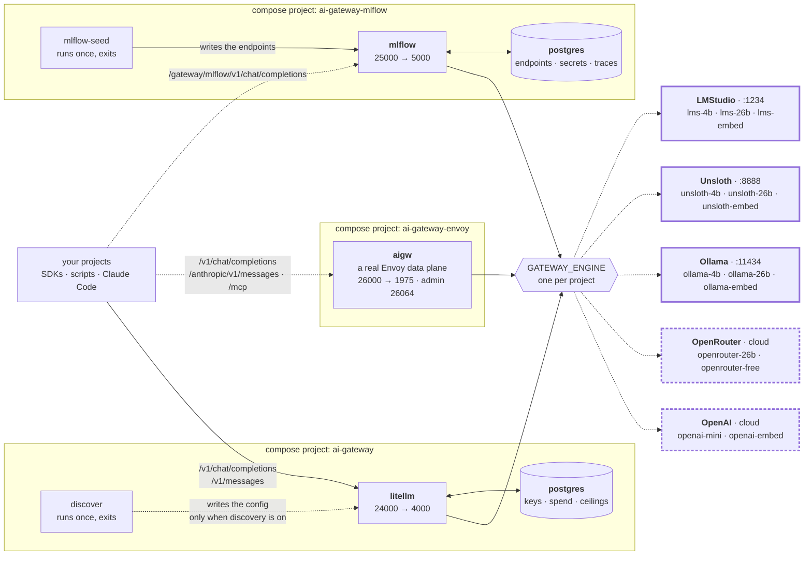

# ai-gateway

**One OpenAI-compatible endpoint in front of every model on your machine.**

Your projects call `http://localhost:24000` and ask for a name like `lms-4b` or `ollama-4b`.
Which model that name points at is decided **here**, in this repo's config — so swapping a
model is one edit here, not an edit in every project that calls it.

```bash
curl http://localhost:24000/v1/chat/completions \
  -H "Authorization: Bearer sk-litellm-master" \
  -H 'Content-Type: application/json' \
  -d '{"model":"lms-4b","messages":[{"role":"user","content":"hi"}]}'
```

It supports five engines: **LMStudio, Unsloth Studio and Ollama** on your own machine, and
**OpenRouter and OpenAI** in the cloud. An engine is an engine — the alias prefix says which
is which, and `openrouter-26b` is the same weights as `lms-26b` on hardware you do not own.

**One engine runs at a time**, and one word in a `.env` picks it. That engine serves two or
three aliases — a small chat model, a large one, an embedder. To compare two engines, change
the word and `up -d` again: the names differ only in the prefix.

## One repo, separate projects

**Each gateway is its own compose project.** It has its own `compose.yml`, its own `.env`, its
own config, its own tests and its own README. You start one by entering its folder. You remove
one by deleting its folder. Nothing at the repo root starts anything.

| Folder | Port | What it is | Start it with |
|:--|:--|:--|:--|
| [`litellm/`](litellm/) | **24000** | the primary endpoint: virtual keys, spend logs, budget ceilings, `/v1/messages`, an admin UI | `cd litellm && docker compose up -d` |
| [`mlflow/`](mlflow/) | **25000** | the same alias names through the MLflow AI Gateway. No key, no ceilings, no `/v1/messages` | `cd mlflow && docker compose up -d` |
| [`envoy/`](envoy/) | **26000** | the same alias names through [Envoy AI Gateway](https://aigateway.envoyproxy.io/docs) in standalone mode — a real Envoy data plane, no Kubernetes. Adds MCP, Prometheus and OpenTelemetry; has no spend controls | `cd envoy && docker compose up -d` |

**Start with `litellm/`.** It is the one every project should call, and the only one with
spend controls — the other two cannot cap a caller at all. `mlflow/` and `envoy/` are second
and third implementations of the same vocabulary, useful for comparing gateways rather than
for running work through.

**`envoy/` is the one you could actually deploy.** Its config is the same Kubernetes
custom-resource API the Envoy AI Gateway controller reads in a cluster, so what is proven on
this laptop is what would ship. It is also the only one here with an **MCP gateway**,
Prometheus metrics and OpenTelemetry tracing.

**All three can run at the same time**, on different ports and different engines, and none
reads a file belonging to another. That independence has a price, and it is the one thing to
know before you add an alias:

> **An alias is one edit per gateway, and nothing checks that you did them all.** Add
> `my-alias` to `litellm/config/<engine>.yaml` only, and it answers on 24000 and 404s on
> 25000 and 26000, with nothing in any log to say why. There used to be a shared test suite
> that caught this. There is not one now.



**Exactly one engine is live per project** — the dashed edges are the ones that are not. Solid
borders are on this machine and free; dashed borders are hosted and **billed**. With a local
engine selected, that gateway has no hosted route at all: not a disabled one, an absent one.
There are no fallback chains either, so picking the engine is the only decision that can cost
money.

**Two of the three run their own postgres.** LiteLLM's holds virtual keys, spend logs and
budget ceilings; MLflow's holds its endpoints, encrypted provider secrets and traces. Neither
publishes a port. **`envoy/` has no database at all** — its whole configuration is one file.

The three local engines run **natively on the host**: they need the GPU. The containers reach
them at `host.containers.internal` / `host.docker.internal`, and every `compose.yml` declares
both names so Docker and Podman behave the same. The two hosted engines need only a
key in your shell.

## Quick start

You need `docker compose` or `podman compose` — **the two are drop-in replacements here**, so
swap the word and nothing else changes — and at least one local engine on the host:
[LMStudio](https://lmstudio.ai), [Ollama](https://ollama.com) or
[Unsloth Studio](https://unsloth.ai). With no local engine at all, use an OpenRouter or OpenAI
key and `GATEWAY_ENGINE=openrouter`.

```bash
cd litellm
cp .env.example .env            # edit GATEWAY_ENGINE if you do not run LMStudio
docker compose up -d            # first boot takes ~60 s: LiteLLM runs schema migrations

curl -fsS http://localhost:24000/health/readiness   # -> {"status":"healthy","db":"connected"}
```

Then get the models for **the one engine you selected** — three each, and you need no others.
The commands are in that engine's config file, which also carries every trap it has:
[`litellm/config/lms.yaml`](litellm/config/lms.yaml),
[`litellm/config/unsloth.yaml`](litellm/config/unsloth.yaml),
[`litellm/config/ollama.yaml`](litellm/config/ollama.yaml). The hosted engines download
nothing.

For the other two gateways, do the same in `mlflow/` and `envoy/`. Each is independent: its
own `.env`, its own engine if you want a different one, and its own `up -d`.

Everything here is measured on an Apple-Silicon MacBook with 128 GB of RAM.

## The aliases

Call these names, never a model name. **All three gateways use the same names**, which is the
whole reason more than one of them exists.

**Every alias names its engine** — `lms-*` is LMStudio, `unsloth-*` is Unsloth, `ollama-*` is
Ollama, `openrouter-*` is OpenRouter, `openai-*` is OpenAI. There is deliberately no
engine-neutral name and no capability name, so a caller always knows which engine answered
and, just as importantly, **who is being billed**. The first three are this machine and free;
the last two are the cloud and cost money.

|  | LMStudio (`:1234`) | Unsloth (`:8888`) | Ollama (`:11434`) | OpenRouter | OpenAI |
|:--|:--|:--|:--|:--|:--|
| **Chat, small** | `lms-4b` | `unsloth-4b` | `ollama-4b` | — | `openai-mini` |
| **Chat, large** | `lms-26b` | `unsloth-26b` | `ollama-26b` | `openrouter-26b` | — |
| **Embed** | `lms-embed` | `unsloth-embed` | `ollama-embed` | — | `openai-embed` |
| **Extra** | — | — | — | `openrouter-free` | — |
| **Costs** | free | free | free | **paid** | **paid** |

That is every alias this repo defines **by hand**. `GATEWAY_ENGINE` selects **one column**, so
a gateway serves two or three names at a time — never the whole table. The rows are the point:
the same model sits across a row, so changing the engine word and re-running the tests
measures the engine and nothing else. You do not need every engine — name the one you have,
and the rest are not in the config at all.

| Alias | Model | Input | Build | Notes |
|:--|:--|--:|:--|:--|
| `lms-4b` | `google/gemma-4-e4b` | 122880 | QAT | tools and vision both work |
| `lms-26b` | `google/gemma-4-26b-a4b-qat` | 253952 | QAT | 26B MoE, ~4B active |
| `lms-embed` | `text-embedding-nomic-embed-text-v1.5` | 2048 | Q4_K_M | 768 dims, 84 MB |
| `unsloth-4b` | `unsloth/gemma-4-E4B-it-qat-GGUF` | 122880 | QAT | same weights as `lms-4b` |
| `unsloth-26b` | `unsloth/gemma-4-26B-A4B-it-qat-GGUF` | 253952 | QAT | same weights as `lms-26b`; **it reasons and `lms-26b` does not** |
| `unsloth-embed` | `second-state/Nomic-embed-text-v1.5-Embedding-GGUF` | 2048 | Q8_0 | 768 dims |
| `ollama-4b` | `gemma4:e4b` | 122880 | **Q4_K_M** | not QAT — see below |
| `ollama-26b` | `gemma4:26b` | 253952 | **Q4_K_M** | not QAT |
| `ollama-embed` | `nomic-embed-text` | 2048 | **F16** | 768 dims, the heaviest of the three |
| `openrouter-26b` | `google/gemma-4-26b-a4b-it` | 245760 | not stated | **$0.07 · $0.34** per 1M in·out |
| `openrouter-free` | `google/gemma-4-26b-a4b-it:free` | 229376 | not stated | free, rate-limited, **LiteLLM only** — see below |
| `openai-mini` | `gpt-5.4-mini` | — | — | **paid**; no vision |
| `openai-embed` | `text-embedding-3-small` | 8191 | — | **paid**, 1536 dims |

Builds measured 2026-08-31 with `lms ls --json` and `ollama show`; the Unsloth figure is the
one its model card states.

`Input` is the usable prompt window: the model's context minus an output reserve — 8192 tokens
on the local routes, larger on the two OpenRouter ones. E4B caps at 131072, hence 122880.
`openai-embed`'s 8191 is the model's own limit, not a subtraction.

**Auto-discovery adds every model you already have**, and it is off by default. `litellm/`
and `mlflow/` each have their own switch and their own copy of the prober; the details are in
each folder's README. **`envoy/` does not have it** — its config is a different shape again and
its image has no Python to run a renderer in. That folder's README explains the gap.

### Two traps when you pick an alias

- **Thinking models spend the reply's budget on thinking, and you cannot guess which ones
  do.** Reasoning tokens come out of the same `max_tokens` allowance as the answer, so a
  ceiling set too low returns **empty content**, `finish_reason: "length"`, and no error at
  all. It is decided **per model and engine**: `unsloth-26b` emits a reasoning block while
  `lms-26b` on identical weights does not (2026-08-27), and `lms-4b` spent 65 of 70 completion
  tokens reasoning (2026-08-28). Treat every chat alias as capable of it. **On port 25000 this
  is your job** — MLflow cannot store a per-route `max_tokens`, so the caller must send one.
- **Embedding vectors do not mix across models — or across *builds* of one model.** All three
  local embedders are nomic v1.5 at 768 dims in a **different build**: Q4_K_M on LMStudio,
  Q8_0 on Unsloth, F16 on Ollama. `openai-embed` is a different model at 1536 dims. A query
  embedded with one, matched against an index built with another, returns quietly worse
  neighbours and never errors. Use one alias per index and record which.

### The two hosted engines

`openrouter` and `openai` are engines like the three local ones — one file per gateway, named
by `GATEWAY_ENGINE` — and differ in one way that is not architectural: **they bill a real
account**. Turn one on with `GATEWAY_ENGINE=openrouter` and the matching key exported. Three
things to know:

- **Do not remove the provider pin on `openrouter-free`.** It carries
  `order: ["google-ai-studio"]` and `allow_fallbacks: false`
  ([`litellm/config/openrouter.yaml`](litellm/config/openrouter.yaml)), because OpenRouter
  load-balances its free tier and one provider returns tool calls as **raw text** with
  `tool_calls` absent. Nothing errors: your agent sees a message with no tool calls, executes
  nothing, and stops. `allow_fallbacks: false` is half the pin — without it OpenRouter
  reroutes exactly when the pinned provider is busy. The price is a 429 when Google AI Studio
  is at its limit: a visible failure over an invisible one.
- **`openrouter-free` is therefore absent from BOTH other gateways.** Neither MLflow nor
  Envoy has an `extra_body` equivalent, so neither can carry the pin, and an unpinned copy
  would look like LiteLLM's route while carrying the failure the pin exists to stop. It is the
  one alias that 404s on 25000 and 26000 by design.
- **On the OpenAI routes, send `max_completion_tokens`, not `max_tokens`.** The gpt-5 family
  rejects `max_tokens` outright. LiteLLM translates it, so 24000 accepts either; MLflow
  forwards parameters exactly as sent, so the same body 400s on 25000 (verified 2026-08-31).
  `max_completion_tokens` works on both.

## Load a model first

The context limits above are only true for a model loaded with matching flags. Each engine
fails differently when the model is not there, and **only Ollama fails loudly**:

| | LMStudio (1234) | Unsloth (8888) | Ollama (11434) |
|:--|:--|:--|:--|
| Key | any string | **required** — every route 401s | ignored entirely |
| Model not loaded | JIT-loads it, quietly at 8192 context | `400 No model loaded`, unless auto-switch is on | loads it, at the model's own context |
| Models held at once | several | **one**, chat and embedder alike — a new request unloads the last | several |
| Idle eviction | 1 h TTL on a JIT load | none — it holds until the next swap | **5 minutes**, by default |
| Reasoning on Gemma 4 | **depends on the model** — off on the 26B, on for E4B | **on** | **on** |
| Build pulled here | QAT | QAT | **Q4_K_M** |
| Source of truth | `lms ps --json` | `GET /v1/status`, with the key | `ollama ps` |

**LMStudio is the dangerous one.** It JIT-loads a model that is not resident, and a JIT load
does **not** inherit hand-load flags: a model you loaded at 262144 comes back at **8192**,
with a 1 h TTL. So a session that worked this morning fails this afternoon with nothing
changed, and the error looks like a gateway bug.

**Unsloth is the one that thrashes when more than one gateway runs.** It holds one model at a
time across chat and embeddings, so a second gateway asking for a different alias swaps the
model back and forth. LMStudio and Ollama do not have this problem.

Each engine's config file carries its own load commands and every trap it has, next to the
aliases they apply to — [`litellm/config/lms.yaml`](litellm/config/lms.yaml),
[`litellm/config/unsloth.yaml`](litellm/config/unsloth.yaml),
[`litellm/config/ollama.yaml`](litellm/config/ollama.yaml). Read the one you are running.

## Tests

**Each project has its own suite**, and it drives its own gateway only.

```bash
cd litellm/tests && uv sync && uv run run_all.py    # 4 rows against 24000
cd mlflow/tests  && uv sync && uv run run_all.py    # 4 rows against 25000
cd envoy/tests   && uv sync && uv run run_all.py    # 4 rows against 26000
```

Every script prints the full response, so each doubles as a sample to copy from; the exit code
is `1` on any failure. **The default alias follows that project's `GATEWAY_ENGINE`** —
`lms-4b`, `unsloth-4b`, `ollama-4b` or `openrouter-26b`, each being the one route on that
engine that is both vision- and tool-capable. `openai` has no default on purpose, because
`gpt-5.4-mini` has no vision.

**This is how you compare engines.** Run a suite, change `GATEWAY_ENGINE`, `up -d`, run it
again: the `-26b` aliases are the same weights on four engines, so the difference is the
engine.

Each suite also **declares its own gateway's calling contract** and checks it, and the three
are genuinely different — a test that assumed "LiteLLM or not-LiteLLM" would be wrong about
Envoy:

| | LiteLLM 24000 | MLflow 25000 | Envoy 26000 |
|:--|:--|:--|:--|
| checks the caller's API key | **yes** | no | no |
| `GET /models` lists the aliases | **yes** | no | **yes** |
| `response.model` echoes the alias | **yes** | no | no |
| stores a per-route `max_tokens` | **yes** | no | no |
| you must send `max_tokens` yourself | no | **yes** | **yes** |

**What no suite checks any more is that the gateways agree with each other.** Before the split
one suite ran every script against both ports and caught the alias lists drifting apart. Each
project now tests itself, and cross-gateway drift is found by calling the ports by hand.

Verified 2026-09-03: 4/4 on `unsloth-4b` in the LiteLLM and MLflow suites, with both up at
once. Verified 2026-09-04: 4/4 on `ollama-4b` in the Envoy suite. What is deliberately not
covered is in each folder's `tests/README.md`.

## Repository layout

```text
ai-gateway/
├── README.md                   this file — the front door and the shared vocabulary
├── litellm/                    compose project `ai-gateway`            PORT 24000
│   ├── compose.yml                 postgres · discover · litellm
│   ├── .env.example                tracked; the key lines are blank BY DESIGN
│   ├── config/                     the alias list — YAML, one file per engine
│   ├── discover/                   auto-discovery: probes + the YAML renderer
│   ├── tests/                      a uv project: 3 call kinds + the contract test
│   └── README.md
├── mlflow/                     compose project `ai-gateway-mlflow`     PORT 25000
│   ├── compose.yml                 postgres · mlflow · mlflow-seed
│   ├── .env.example
│   ├── config/                     the alias list — Python, one file per engine
│   ├── discover/                   auto-discovery: the probes only, no renderer
│   ├── tests/
│   └── README.md
├── envoy/                      compose project `ai-gateway-envoy`      PORT 26000
│   ├── compose.yml                 ONE service: aigw. No database
│   ├── .env.example
│   ├── config/                     the alias list — Kubernetes custom resources
│   ├── tests/
│   └── README.md
└── .claude/                    the working contract for AI agents in this repo
```

**Nothing is shared between the folders**, including the auto-discovery prober: `litellm/` and
`mlflow/` each carry their own copy, so either can be deleted whole. The probe functions in
the two copies are identical and both file headers say to fix them together.

## Design decisions

- **Each gateway is a standalone compose project.** They were one project with compose
  profiles until 2026-09-03. The profile switch was replaced by the directory you stand in:
  removing a gateway is now `rm -rf` plus a doc edit, and no project can break another by a
  bad edit. The costs are real and listed above — two postgres containers, a `.env` each, an
  alias that has to be added three times, and no suite that checks the three agree. Adding
  `envoy/` on 2026-09-04 was the first test of the design, and it touched nothing existing.
- **Envoy AI Gateway runs in standalone mode, not Kubernetes.** `aigw run` reads the same
  custom resources a cluster would and starts a real Envoy from them, so the config is
  portable without the repo carrying a cluster. What it costs is spend control: `QuotaPolicy`
  and token rate limiting need Redis and an Envoy Gateway install, so budgets stay LiteLLM's
  job alone.
- **One engine at a time, and no mechanism to select more.** The alternative was a list, which
  needs something to turn that list into LiteLLM's single `--config` file — eight composed
  files, then a generator script, both of which existed and both of which are gone. One word
  in a filename needs neither. The cost is that comparing two engines is a restart rather than
  a second alias; the gain is that the whole selection mechanism is a filename.
- **Two or three aliases per engine, and no more.** A small chat model, a large one, an
  embedder. There was a twenty-alias list with a size ladder and role names; it was deleted on
  2026-08-31, because a gateway is useless until the models are on disk, and the ladder was
  documentation of one laptop rather than a thing anyone else could run.
- **Every alias names its engine.** `local` existed and hid which engine answered; `cheap`,
  `standard` and `frontier` existed and hid who was **billed**. Both were removed for the same
  reason — a name should answer the question you would otherwise have to go and look up.
- **No alias falls back to another.** A chain would be more resilient and would break the two
  things this repo is for: a comparison stops being a comparison the moment a request can
  silently run somewhere else, and a free session can silently become a paid one.
- **No trace store for other projects.** MLflow here traces only what passes through its own
  endpoints; `success_callback` is empty on purpose, because two projects sharing one
  experiment namespace makes "did this get better" ambiguous. Trace client-side instead.
- **Ports 24000 / 25000.** The failure worth avoiding is not a loud bind error but the silent
  one — a health probe against `localhost:4000` that a *different* stack answers, going
  green. Container-internal ports are unchanged.

## Contributing

Issues and pull requests are welcome. Most changes here are an alias — a model you run that
this repo does not name yet — and there is one rule that catches everyone:

> **An alias is one edit per gateway you run — three, if you run all three.** Add it to
> `litellm/config/<engine>.yaml`, `mlflow/config/<engine>.py` **and**
> `envoy/config/<engine>.yaml`. Do one and the name answers on that port and 404s on the
> others, with nothing in any log to say why, and no test that catches it.

1. Fork, then branch — `git checkout -b feature/my-alias`.
2. Edit that engine's file — `litellm/config/<engine>.yaml`. Keep it to two or three aliases:
   a small chat model, a large one, an embedder. That shape is the point. On the LiteLLM side
   an alias needs four things: the `model_list` entry, its shadow price, its
   `max_input_tokens`, and a row in the table above. Miss the price and a budget ceiling
   becomes a no-op.
3. Do the same in `mlflow/config/<engine>.py` and `envoy/config/<engine>.yaml`. On the Envoy
   side an alias is one `AIGatewayRoute` rule: an exact `x-ai-eg-model` match, a
   `modelNameOverride`, and a `request` timeout.
4. Prove it on **every** port you added it to — `up -d` in each folder, then
   `uv run run_all.py --model <your-alias>` in each `tests/`.
5. Open a pull request saying which engines, models and machine you ran it against.

**There is no CI.** The three suites are the whole check, and they only run against models on
your own disk — so the pull request has to carry that evidence itself. Numbers in the config
get a comment saying where they came from; a claim in this file gets the date it was verified.

The working contract for AI coding agents in this repo is [`.claude/`](.claude/), and it is
worth a read before a larger change.

## License

[MIT](LICENSE).
